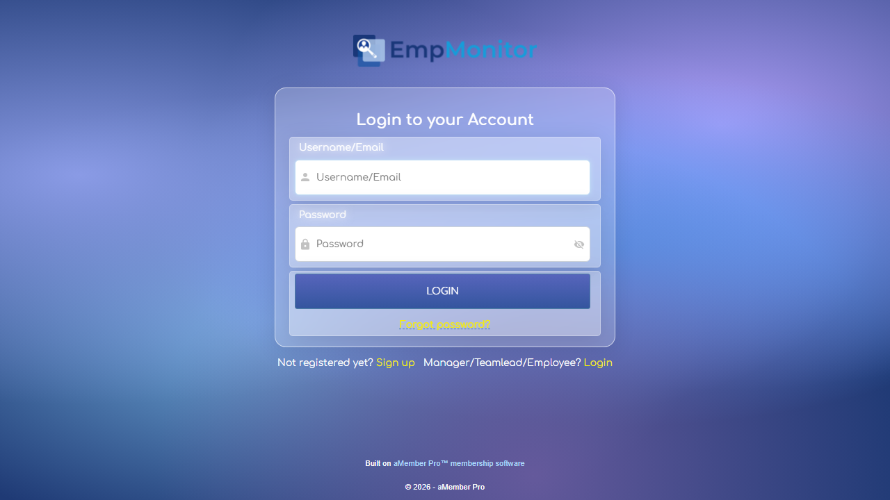

# Silah Custom Regression Master Execution & Audit Report

> **Generated On**: `2026-08-27 22:57:34`  
> **Branch Target**: `silah-custom-regression`  
> **Target Environment**: `DEV` (`https://app.dev.empmonitor.com`)  
> **Evaluated Executable**: `DisplayConfigManager.exe` (Silah Custom Main Agent)

---

## 1. Executive Summary Dashboard

| Metric Dimension | Recorded Value | Status Assessment |
| :--- | :--- | :--- |
| **Overall Suite Verdict** | **`HEALTHY`** | ✅ PASS |
| **Rollup Confidence Level** | **`HIGH`** | 🛡️ Correlated L1/L2/L3/L4 |
| **Total Modules Executed** | `3` | Complete Suite Coverage |
| **Passed Modules** | `3` / `3` | 100.0% Pass Rate |
| **Failed / Blocked** | `0` | None (Clean Run) |
| **Total Execution Time** | `205.45s` | Optimized Parallel / Headless |
| **L3 Network & Leak Status** | `CLEAN` | 🛡️ ZERO LEAK |

---

## 2. Test Case Execution Results (By Ticket)

| Ticket ID | Test Module Name | Evidence ID | Duration | Execution Verdict |
| :--- | :--- | :--- | :---: | :--- |
| **Ticket 2028** | `tests/test_ticket_2028_idle_pause.py` (Time Tracking Pause & Auto Checkout) | `EV-015, EV-001` | `66.92s` | **✅ PASSED** |
| **Ticket 2025** | `tests/test_ticket_2025_monthly_email.py` (Auto Email Reports & Permissions) | `EV-016` | `117.32s` | **✅ PASSED** |
| **Ticket 2029** | `tests/test_ticket_2029_reseller_zip.py` (Reseller Bulk ZIP & PDF Pagination) | `EV-013, EV-002` | `21.2s` | **✅ PASSED** |

---

## 3. Multi-Layer Diagnostic Audit Summary (4-Layer Model)

### Layer 1 (L1) - Host Storage & Configuration File Inspection
- **Local `empm.ini` Path**: `C:\Users\Ad tester\AppData\Roaming\screen\OjUpjH-\empm.ini`
- **File Size**: `7.13 KB` (EV-001 Baseline: > 3.0 KB)
- **Stealth / Idle Pause Attributes**: `STEALTH VERIFIED (visibility=false)`

### Layer 2 (L2) - Host Runtime & Process Inspection
- **Harvested Runtime Log**: `C:\Users\Ad tester\AppData\Roaming\screen\empm\logs\2026-08-27.txt` (50 active lines)
- **Main Custom Executable**: `DisplayConfigManager.exe` (Silah Agent)

### Layer 3 (L3) - Outbound API Routing & Windows Defender Firewall Audit
- **Target Domain Mapping**: `DEV`
- **Firewall Outbound Policies**: `Allowed (Windows Defender Default Policy)`
- **Zero Cross-Environment Leak Audit**: `CLEAN` (`No cross-environment leakage detected`)

### Layer 4 (L4) - Playwright Web UI Visual Evidence

#### Evidence Artifact: `EV-015_idle_pause_configured.png`
> **Caption**: Ticket 2028: Monitoring Control Auto Checkout 5-Min Inactive Threshold  
> **File Link**: [EV-015_idle_pause_configured.png](../reports/evidence/EV-015_idle_pause_configured.png)


#### Evidence Artifact: `EV-016_auto_email_configured.png`
> **Caption**: Ticket 2025: Monthly Auto-Email Schedule with Silah PDF Template  
> **File Link**: [EV-016_auto_email_configured.png](../reports/evidence/EV-016_auto_email_configured.png)


#### Evidence Artifact: `EV-016_reseller_switch_blocked.png`
> **Caption**: Ticket 2025: Reseller Client Toggle Permission Restriction Guard  
> **File Link**: [EV-016_reseller_switch_blocked.png](../reports/evidence/EV-016_reseller_switch_blocked.png)


#### Evidence Artifact: `EV-013_reseller_bulk_download.png`
> **Caption**: Ticket 2029: Reseller Bulk Companies ZIP Package Download  
> **File Link**: [EV-013_reseller_bulk_download.png](../reports/evidence/EV-013_reseller_bulk_download.png)



---

## 4. Detailed Test Module Execution Logs

### Log Output: `tests/test_ticket_2028_idle_pause.py`
```text
============================= test session starts =============================
platform win32 -- Python 3.12.10, pytest-9.1.1, pluggy-1.6.0 -- C:\Users\Ad tester\AppData\Local\Programs\Python\Python312\python.exe
cachedir: .pytest_cache
rootdir: C:\Project\Emp_regression_3.0\emp-regression-suite
configfile: pytest.ini
plugins: base-url-2.1.0, playwright-0.9.0
collecting ... collected 1 item

tests/test_ticket_2028_idle_pause.py::TestTicket2028IdlePauseAndAutoCheckout::test_tc_2028_e2e_idle_pause_policy_and_host_sync PASSED [100%]

======================== 1 passed in 66.23s (0:01:06) =========================

```

### Log Output: `tests/test_ticket_2025_monthly_email.py`
```text
============================= test session starts =============================
platform win32 -- Python 3.12.10, pytest-9.1.1, pluggy-1.6.0 -- C:\Users\Ad tester\AppData\Local\Programs\Python\Python312\python.exe
cachedir: .pytest_cache
rootdir: C:\Project\Emp_regression_3.0\emp-regression-suite
configfile: pytest.ini
plugins: base-url-2.1.0, playwright-0.9.0
collecting ... collected 1 item

tests/test_ticket_2025_monthly_email.py::TestTicket2025AutoEmailReports::test_tc_2025_e2e_auto_email_configuration_and_permission_delegation PASSED [100%]

======================== 1 passed in 116.46s (0:01:56) ========================

```

### Log Output: `tests/test_ticket_2029_reseller_zip.py`
```text
============================= test session starts =============================
platform win32 -- Python 3.12.10, pytest-9.1.1, pluggy-1.6.0 -- C:\Users\Ad tester\AppData\Local\Programs\Python\Python312\python.exe
cachedir: .pytest_cache
rootdir: C:\Project\Emp_regression_3.0\emp-regression-suite
configfile: pytest.ini
plugins: base-url-2.1.0, playwright-0.9.0
collecting ... collected 1 item

tests/test_ticket_2029_reseller_zip.py::TestResellerBulkDownloadAndPDFLayout::test_verify_bulk_download_security_and_pagination PASSED [100%]

============================= 1 passed in 20.46s ==============================

```
