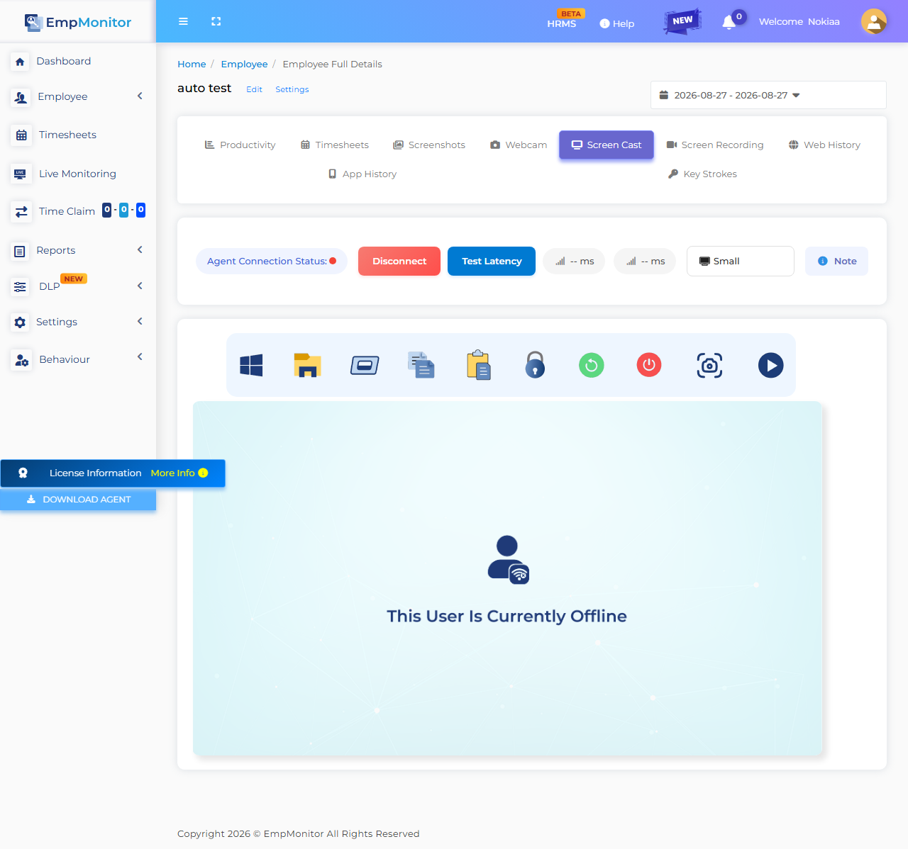

# Custom Agent Stealth & Security Regression Report

> **Generated On**: `2026-08-27 12:16:47`  
> **Target Environment**: `LIVE` (`https://app.empmonitor.com`)  
> **Agent Version Evaluated**: `3.0.1`

---

## 1. Executive Summary & Verdicts

| Audit Dimension | Evaluation Result | Status |
| :--- | :--- | :--- |
| **Final Report Verdict** | **`FAILED`** | ❌ FAIL |
| **Covert Cloaking Verdict** | **`BREACHED (Trace elements found in Registry)`** | 🚨 BREACHED |
| **Cross-Environment Leak Check** | `CLEAN` (No cross-environment leakage detected) | 🛡️ CLEAN |
| **Dashboard Visibility Setting** | `Visible` (Expected: Stealth) | ⚠️ MISMATCH |
| **Target Dashboard User** | `auto test` | ✅ FOUND |
| **Host INI Visibility Flag** | `MISMATCH (Expected stealth=false, got visibility=true)` | ⚠️ AUDIT |
| **Screencast Stream Status** | `OFFLINE / FALLBACK` | ⚪ STANDBY |

### ℹ️ Operator Overrides / Tolerated Conflicts

- 🟡 **[TOLERATED CONFLICT]**: Visibility Mode: OPERATOR_SKIPPED_CONFLICT

### ⚠️ Discrepancy & Security Breach Warnings

- 🔴 **[FAILURE REASON]**: Control Panel Registry Cloaking Failed: 2 trace element(s) discovered in uninstallation registry keys.
- 🔴 **[FAILURE REASON]**: Dashboard Visibility Setting Mismatch! Expected 'Stealth', but active mode is 'Visible'.

---

## 2. Custom Binary & Process Mapping

| Executable Role | Configured Process Name | Disk Binary Status | Host Process Runtime Status |
| :--- | :--- | :--- | :--- |
| **Main Agent** | `DisplayConfigManager.exe` | `NOT DETECTED ON DISK` | `RUNNING (PID=29256, Status=running)` |
| **Watchdog / Service** | `UpdateMgr_DCM.exe` | `NOT DETECTED ON DISK` | `INACTIVE` |
| **Screencast / Helper** | `esr.exe` | `NOT DETECTED ON DISK` | `INACTIVE` |
| **Helper Service** | `DisplayConfigHelper.exe` | `NOT DETECTED ON DISK` | `RUNNING (PID=28504, Status=running)` |

---

## 3. Windows Control Panel Visibility Audit (winreg)

To verify that the custom stealth agent is invisible to host users in the Windows Control Panel (Add/Remove Programs), the three primary Windows uninstallation registry hives were audited:

| Scanned Registry Pathway | Scope / Architecture | Subkeys Audited | Cloaking Status |
| :--- | :--- | :---: | :--- |
| `HKLM\SOFTWARE\Microsoft\Windows\CurrentVersion\Uninstall (64-bit)` | 64-bit System Applications (HKLM) | 53 | **BREACHED (2 traces found)** |
| `HKLM\SOFTWARE\Wow6432Node\Microsoft\Windows\CurrentVersion\Uninstall (32-bit)` | 32-bit Applications on 64-bit OS (HKLM Wow6432Node) | 46 | **SECURE (0 traces found)** |
| `HKCU\Software\Microsoft\Windows\CurrentVersion\Uninstall` | Current User Scope Applications (HKCU) | 11 | **SECURE (0 traces found)** |

### 🚨 Detected Registry Breach Entries

| Registry Hive | SubKey Name | Matched Field | Matched Value | Trigger Token |
| :--- | :--- | :--- | :--- | :--- |
| `64-bit System Applications (HKLM)` | `{B947E73A-E61B-463E-8F77-FECADB809F50}` | `DisplayName` | `DisplayConfigManager` | `displayconfigmanager` |
| `64-bit System Applications (HKLM)` | `{B947E73A-E61B-463E-8F77-FECADB809F50}` | `Publisher` | `DisplayConfigManager` | `displayconfigmanager` |

---

## 4. Host Configuration & Storage Diagnostics (L1 / L2)

- **Local INI Path**: `C:\Users\GBSBHL1261\AppData\Roaming\screen\OjUxFCN\empm.ini`
- **INI File Size**: `4.47 KB` (EV-001 Requirement: > 3.0 KB)
- **Local Active Host Email**: `autotest@gmail.com`
- **Visibility Flag in INI**: `true` (MISMATCH (Expected stealth=false, got visibility=true))

### Sanitized `config.js` Contents (Masked)
```json
Not Found
```

### Sanitized `empm.ini` Attributes (Masked)
```ini
[General] last_sync_time = @DateTime(\0\0\0\x10\0\0\0\0\0\0%\x8e`\x2\xa0\x98\x80\0)
[appSettings] currentdate = @Variant(\0\0\0\xe\0%\x8e`)
[appSettings] datasendingperiodsec = 180
[appSettings] lastsettingsaccessdatetime = @DateTime(\0\0\0\x10\0\0\0\0\0\0%\x8e`\x1tA\x15\x1)
[appSettings] todayremainingbreakinseconds = 1800
[appSettings] from_remote\aduserinfosendpersec = 21600
[appSettings] from_remote\screenshotperiodsec = 60
[appSettings] screenshotquality = 20
[auth] token = ****************
[auth] email = autotest@gmail.com
[auth] crypto_password = ****************
[settings] code = 200
[settings] data\agentuninstallcode = 
[settings] data\announcemnts = @Invalid()
[settings] data\block\contact = undefined
[settings] data\block\email = undefined
[settings] data\block\logo = https://service.empmonitor.com/logo/1662536930741remote_lock_logo.png
[settings] data\breakinminute = 0
[settings] data\dlpfeatures\bluetoothblock = 0
[settings] data\dlpfeatures\bluetoothdetection = 0
[settings] data\dlpfeatures\clipboardblock = 0
[settings] data\dlpfeatures\clipboarddetection = 1
[settings] data\email_monitoring_block_websites = @Variant(\0\0\0\t\0\0\0\x1\0\0\0\n\0\0\0\x1a\0g\0l\0o\0\x62\0u\0s\0s\0o\0\x66\0t\0.\0i\0n)
[settings] data\features\screencast = 1
[settings] data\features\application_usage = 0
[settings] data\features\autocheckout = 0
[settings] data\features\block_websites = 1
[settings] data\features\email_monitoring = 1
[settings] data\features\file_upload_blocking = 1
[settings] data\features\file_upload_detection = 1
[settings] data\features\keystrokes = *
[settings] data\features\mobile_detection_webcam_alert_enabled = 0
[settings] data\features\realtimetrack = 1
[settings] data\features\remoteterminalaccess = 0
[settings] data\features\screen_record = 0
[settings] data\features\screenshots = 1
[settings] data\features\webcamcapture = 0
[settings] data\features\webcamcasting = 0
[settings] data\features\web_usage = 1
[settings] data\features\webcam_alert_enabled = 0
[settings] data\file_upload_block_websites = gemini.google.com, whatsapp.com, chatgpt.com, web.telegram.org, www.ilovepdf.com
[settings] data\file_upload_screenshot_alert = 1
[settings] data\first_name = auto
[settings] data\idleinminute = 5
[settings] data\issilahmobilegeolocation = 0
[settings] data\is_attendance_override = 0
[settings] data\last_name = test
[settings] data\logo = https://service.empmonitor.com/logo/1662536930741remote_lock_logo.png
[settings] data\logoutoptions\afterfixedhours = 8
[settings] data\logoutoptions\option = 2
[settings] data\logoutoptions\specifictimeutc = 23:59
[settings] data\logoutoptions\specifictimeuser = 23:59
[settings] data\logout_feature = true
[settings] data\manual_clock_in = 0
[settings] data\pack\expiry = 2037-12-31
[settings] data\pack\id = 1
[settings] data\roomid = a8a877faab1ec5ac0f53520f41a544cb:ebbc73a4ba20cd12389171e3b5a291bc
[settings] data\screen_record\audio = 0
[settings] data\screen_record\is_enabled = 1
[settings] data\screen_record\video_quality = 1
[settings] data\screenshot\frequencyperhour = 60
[settings] data\silahmobilegeolocationfrequency = 30
[settings] data\system\autoupdate = 0
[settings] data\system\tracking = 1
[settings] data\system\type = 1
[settings] data\system\visibility = true
[settings] data\systemlock = 0
[settings] data\timesheetidletime = 00:00
[settings] data\tracking\app\appblocklist = @Invalid()
[settings] data\tracking\app\keystrokeblocklist = ****************
[settings] data\tracking\app\keystrokewhitelist = ****************
[settings] data\tracking\domain\appblocklist = 
[settings] data\tracking\domain\daysandtimes = @Variant(\0\0\0\b\0\0\0\0)
[settings] data\tracking\domain\keystrokeblocklist = **********
[settings] data\tracking\domain\keystrokewhitelist = **********
[settings] data\tracking\domain\monitoronly = @Invalid()
[settings] data\tracking\domain\suspendkeystrokespasswords = *****
[settings] data\tracking\domain\suspendkeystrokeswhenvisited = **********
[settings] data\tracking\domain\suspendmonitorwhencontains = @Invalid()
[settings] data\tracking\domain\suspendmonitorwhenvisited = @Invalid()
[settings] data\tracking\domain\suspendmonitorwhenvisitedincategory = @Invalid()
[settings] data\tracking\domain\suspendprivatebrowsing = false
[settings] data\tracking\domain\websiteblocklist = @Variant(\0\0\0\t\0\0\0\x1\0\0\0\n\0\0\0 \0w\0w\0w\0.\0\x66\0\x61\0\x63\0\x65\0\x62\0o\0o\0k\0.\0\x63\0o\0m)
[settings] data\tracking\geolocation = @Invalid()
[settings] data\tracking\keystrokepolicymode = *******
[settings] data\tracking\networkbased = @Invalid()
[settings] data\tracking\projectbased = @Invalid()
[settings] data\tracking\unlimited\day = "1,2,3,4,5,6,7"
[settings] data\trackingmode = unlimited
[settings] data\usbdisable = 0
[settings] data\userblock = 0
[settings] data\webcam\frequencyperhour = 1
[settings] error = @Variant(\0\0\0\x94)
[settings] message = User configs
```

---

## 5. Layer 3 (L3) - Outbound Network & Firewall Audit

- **Target Routing Environment:** `live`
- **Active Firewall Exceptions:**
  - `DisplayConfigManager.exe`: `Allowed (Default Outbound Policy)`
  - `UpdateMgr_DCM.exe`: `Allowed (Default Outbound Policy)`
  - `esr.exe`: `Allowed (Default Outbound Policy)`
  - `DisplayConfigHelper.exe`: `Allowed (Default Outbound Policy)`
- **API Connectivity Matrix:**
  - `track.empmonitor.com`: `SUCCESS (Resolved IP: 140.245.12.172)`
  - `storelogs.dev.empmonitor.com`: `SUCCESS (Resolved IP: 140.245.19.218)`
  - `realtime.empmonitor.com`: `SUCCESS (Resolved IP: 152.67.8.253)`
  - `remote.empmonitor.com`: `SUCCESS (Resolved IP: 152.67.8.253)`
  - `service.empmonitor.com`: `SUCCESS (Resolved IP: 140.245.12.172)`
  - `updates.empmonitor.in`: `SUCCESS (Resolved IP: 129.154.230.99)`
- **Leak Integrity check:** `CLEAN (No cross-environment leakage detected)`

---

## 6. Host Log Harvest (Last 200 Lines)

```text

2026-08-27T06:30:50Z - info: Position Updated

2026-08-27T06:30:50Z - info: Position Updated at : "Thu Aug 27 2026" , "12:00:50" , Latitude:  21.2013 ,  Longitude:  81.3239

2026-08-27T06:31:37Z - info: Requesting url :  "https://track.empmonitor.com/api/v3/user/system-info"  Reply code :  200  server message : "User system info is already the latest"

2026-08-27T06:31:39Z - info: Requesting url :  "https://storelogs.dev.empmonitor.com/api/v1/desktop/upload-screenshots"  Reply code :  0  server message : "Successfully screenshot uploaded"

2026-08-27T06:32:37Z - info: Requesting url :  "https://track.empmonitor.com/api/v3/user/system-info"  Reply code :  200  server message : "User system info is already the latest"

2026-08-27T06:32:39Z - info: Adding new session data with id  QDateTime(2026-08-27 06:29:39.051 UTC Qt::UTC)

2026-08-27T06:32:39Z - info: Trying to send new session data

2026-08-27T06:32:39Z - info: Requesting url :  "https://track.empmonitor.com/api/v3/user/config"  Reply code :  200  server message : "User configs"

2026-08-27T06:32:39Z - warning: Could not get the INetworkConnection instance for the adapter GUID.

2026-08-27T06:32:39Z - info: Requesting for add-activity   Reply code : 200  server message : "Data saved"  error message : ""

2026-08-27T06:32:39Z - info: Memory Usage : 18.6914 MB

2026-08-27T06:32:39Z - info: Requesting url :  "https://storelogs.dev.empmonitor.com/api/v1/desktop/upload-screenshots"  Reply code :  0  server message : "Successfully screenshot uploaded"

2026-08-27T06:33:37Z - info: Requesting url :  "https://track.empmonitor.com/api/v3/user/system-info"  Reply code :  200  server message : "User system info is already the latest"

2026-08-27T06:33:39Z - info: Requesting url :  "https://storelogs.dev.empmonitor.com/api/v1/desktop/upload-screenshots"  Reply code :  0  server message : "Successfully screenshot uploaded"

2026-08-27T06:33:50Z - info: Position Updated

2026-08-27T06:33:50Z - info: Position Updated at : "Thu Aug 27 2026" , "12:03:50" , Latitude:  21.2013 ,  Longitude:  81.3239

2026-08-27T06:33:50Z - info: Position Updated

2026-08-27T06:33:50Z - info: Position Updated at : "Thu Aug 27 2026" , "12:03:50" , Latitude:  21.2013 ,  Longitude:  81.3239

2026-08-27T06:34:37Z - info: Requesting url :  "https://track.empmonitor.com/api/v3/user/system-info"  Reply code :  200  server message : "User system info is already the latest"

2026-08-27T06:34:39Z - info: Requesting url :  "https://storelogs.dev.empmonitor.com/api/v1/desktop/upload-screenshots"  Reply code :  0  server message : "Successfully screenshot uploaded"

2026-08-27T06:35:37Z - info: Requesting url :  "https://track.empmonitor.com/api/v3/user/system-info"  Reply code :  200  server message : "User system info is already the latest"

2026-08-27T06:35:39Z - info: Adding new session data with id  QDateTime(2026-08-27 06:32:39.028 UTC Qt::UTC)

2026-08-27T06:35:39Z - info: Trying to send new session data

2026-08-27T06:35:39Z - info: Requesting url :  "https://track.empmonitor.com/api/v3/user/config"  Reply code :  200  server message : "User configs"

2026-08-27T06:35:39Z - warning: Could not get the INetworkConnection instance for the adapter GUID.

2026-08-27T06:35:39Z - info: Requesting for add-activity   Reply code : 200  server message : "Data saved"  error message : ""

2026-08-27T06:35:39Z - info: Memory Usage : 18.9141 MB

2026-08-27T06:35:39Z - info: Requesting url :  "https://storelogs.dev.empmonitor.com/api/v1/desktop/upload-screenshots"  Reply code :  0  server message : "Successfully screenshot uploaded"

2026-08-27T06:36:37Z - info: Requesting url :  "https://track.empmonitor.com/api/v3/user/system-info"  Reply code :  200  server message : "User system info is already the latest"

2026-08-27T06:36:39Z - info: Requesting url :  "https://storelogs.dev.empmonitor.com/api/v1/desktop/upload-screenshots"  Reply code :  0  server message : "Successfully screenshot uploaded"

2026-08-27T06:36:50Z - info: Position Updated

2026-08-27T06:36:50Z - info: Position Updated at : "Thu Aug 27 2026" , "12:06:50" , Latitude:  21.2013 ,  Longitude:  81.3239

2026-08-27T06:36:50Z - info: Position Updated

2026-08-27T06:36:50Z - info: Position Updated at : "Thu Aug 27 2026" , "12:06:50" , Latitude:  21.2013 ,  Longitude:  81.3239

2026-08-27T06:37:37Z - info: Requesting url :  "https://track.empmonitor.com/api/v3/user/system-info"  Reply code :  200  server message : "User system info is already the latest"

2026-08-27T06:37:39Z - info: Requesting url :  "https://storelogs.dev.empmonitor.com/api/v1/desktop/upload-screenshots"  Reply code :  0  server message : "Successfully screenshot uploaded"

2026-08-27T06:38:37Z - info: Requesting url :  "https://track.empmonitor.com/api/v3/user/system-info"  Reply code :  200  server message : "User system info is already the latest"

2026-08-27T06:38:39Z - info: Adding new session data with id  QDateTime(2026-08-27 06:35:39.045 UTC Qt::UTC)

2026-08-27T06:38:39Z - info: Trying to send new session data

2026-08-27T06:38:39Z - info: Requesting url :  "https://track.empmonitor.com/api/v3/user/config"  Reply code :  200  server message : "User configs"

2026-08-27T06:38:39Z - warning: Could not get the INetworkConnection instance for the adapter GUID.

2026-08-27T06:38:39Z - info: Requesting for add-activity   Reply code : 200  server message : "Data saved"  error message : ""

2026-08-27T06:38:39Z - info: Memory Usage : 19.1055 MB

2026-08-27T06:38:39Z - info: Requesting url :  "https://storelogs.dev.empmonitor.com/api/v1/desktop/upload-screenshots"  Reply code :  0  server message : "Successfully screenshot uploaded"

2026-08-27T06:39:24Z - info: Position Updated

2026-08-27T06:39:24Z - info: Position Updated at : "Thu Aug 27 2026" , "12:09:24" , Latitude:  21.2013 ,  Longitude:  81.3239

2026-08-27T06:39:37Z - info: Requesting url :  "https://track.empmonitor.com/api/v3/user/system-info"  Reply code :  200  server message : "User system info is already the latest"

2026-08-27T06:39:39Z - info: Requesting url :  "https://storelogs.dev.empmonitor.com/api/v1/desktop/upload-screenshots"  Reply code :  0  server message : "Successfully screenshot uploaded"

2026-08-27T06:40:37Z - info: Requesting url :  "https://track.empmonitor.com/api/v3/user/system-info"  Reply code :  0  server message : "Exceeded the number of allotted requests in a specific time frame"

2026-08-27T06:40:37Z - critical: failed for URL:  QUrl("https://track.empmonitor.com/api/v3/user/system-info") netErrCode: QNetworkReply::AuthenticationRequiredError ,response: "{\"success\":false,\"error\":\"Exceeded the number of allotted requests in a specific time frame\",\"message\":\"Exceeded the number of allotted requests in a specific time frame\"}" ,netErrStr: "Host requires authentication"

2026-08-27T06:40:39Z - info: Requesting url :  "https://storelogs.dev.empmonitor.com/api/v1/desktop/upload-screenshots"  Reply code :  0  server message : "Successfully screenshot uploaded"

2026-08-27T06:41:37Z - info: Requesting url :  "https://track.empmonitor.com/api/v3/user/system-info"  Reply code :  0  server message : "Exceeded the number of allotted requests in a specific time frame"

2026-08-27T06:41:37Z - critical: failed for URL:  QUrl("https://track.empmonitor.com/api/v3/user/system-info") netErrCode: QNetworkReply::AuthenticationRequiredError ,response: "{\"success\":false,\"error\":\"Exceeded the number of allotted requests in a specific time frame\",\"message\":\"Exceeded the number of allotted requests in a specific time frame\"}" ,netErrStr: "Host requires authentication"

2026-08-27T06:41:39Z - info: Adding new session data with id  QDateTime(2026-08-27 06:38:39.046 UTC Qt::UTC)

2026-08-27T06:41:39Z - info: Trying to send new session data

2026-08-27T06:41:39Z - info: Requesting for add-activity   Reply code : 200  server message : "Data saved"  error message : ""

2026-08-27T06:41:39Z - info: Memory Usage : 19.043 MB

2026-08-27T06:41:39Z - info: Requesting url :  "https://storelogs.dev.empmonitor.com/api/v1/desktop/upload-screenshots"  Reply code :  0  server message : "Successfully screenshot uploaded"

2026-08-27T06:42:24Z - info: Position Updated

2026-08-27T06:42:24Z - info: Position Updated at : "Thu Aug 27 2026" , "12:12:24" , Latitude:  21.2013 ,  Longitude:  81.3239

2026-08-27T06:42:37Z - info: Requesting url :  "https://track.empmonitor.com/api/v3/user/system-info"  Reply code :  200  server message : "User system info is already the latest"

2026-08-27T06:42:39Z - info: Requesting url :  "https://storelogs.dev.empmonitor.com/api/v1/desktop/upload-screenshots"  Reply code :  0  server message : "Successfully screenshot uploaded"

2026-08-27T06:42:44Z - info: Position Updated

2026-08-27T06:42:44Z - info: Position Updated at : "Thu Aug 27 2026" , "12:12:44" , Latitude:  21.2013 ,  Longitude:  81.3239

2026-08-27T06:43:05Z - info: Keyboard layout changed: en-IN

2026-08-27T06:43:06Z - info: Keyboard layout changed: en-US

2026-08-27T06:43:37Z - info: Requesting url :  "https://track.empmonitor.com/api/v3/user/system-info"  Reply code :  200  server message : "User system info is already the latest"

2026-08-27T06:43:39Z - info: Requesting url :  "https://storelogs.dev.empmonitor.com/api/v1/desktop/upload-screenshots"  Reply code :  0  server message : "Successfully screenshot uploaded"

2026-08-27T06:44:37Z - info: Requesting url :  "https://track.empmonitor.com/api/v3/user/system-info"  Reply code :  200  server message : "User system info is already the latest"

2026-08-27T06:44:39Z - info: Adding new session data with id  QDateTime(2026-08-27 06:41:39.074 UTC Qt::UTC)

2026-08-27T06:44:39Z - info: Trying to send new session data

2026-08-27T06:44:39Z - info: Requesting url :  "https://track.empmonitor.com/api/v3/user/config"  Reply code :  200  server message : "User configs"

2026-08-27T06:44:39Z - warning: Could not get the INetworkConnection instance for the adapter GUID.

2026-08-27T06:44:39Z - info: Requesting for add-activity   Reply code : 200  server message : "Data saved"  error message : ""

2026-08-27T06:44:39Z - info: Memory Usage : 19.0391 MB

2026-08-27T06:44:39Z - info: Requesting url :  "https://storelogs.dev.empmonitor.com/api/v1/desktop/upload-screenshots"  Reply code :  0  server message : "Successfully screenshot uploaded"

2026-08-27T06:45:37Z - info: Requesting url :  "https://track.empmonitor.com/api/v3/user/system-info"  Reply code :  200  server message : "User system info is already the latest"

2026-08-27T06:45:39Z - info: Requesting url :  "https://storelogs.dev.empmonitor.com/api/v1/desktop/upload-screenshots"  Reply code :  0  server message : "Successfully screenshot uploaded"

2026-08-27T06:45:44Z - info: Position Updated

2026-08-27T06:45:44Z - info: Position Updated at : "Thu Aug 27 2026" , "12:15:44" , Latitude:  21.2013 ,  Longitude:  81.3239


!!!!!!!!! Application started at Thu Aug 27 06:46:29 2026 GMT UTC time

2026-08-27T06:46:29Z - info: Changing tracking mode from " initial " to " "unlimited" "
2026-08-27T06:46:29Z - critical: thisApp()->m_isLogoutEnabled in settings  true
2026-08-27T06:46:29Z - info: QVariant(QString, "Allow")
2026-08-27T06:46:29Z - info: QVariant(QString, "Allow")
2026-08-27T06:46:29Z - info: Shared key "emp_monitor_shared_memory_for_user_GBSBHL1261"
2026-08-27T06:46:29Z - info: Setting shared key
2026-08-27T06:46:29Z - info: Assigning registry value
2026-08-27T06:46:29Z - info: Registering instances
2026-08-27T06:46:29Z - info: Worker thread instance
2026-08-27T06:46:29Z - info: Network thread instance
2026-08-27T06:46:29Z - critical: Trying to get watchdog service
2026-08-27T06:46:30Z - warning: QWidget::setLayout: Attempting to set QLayout "" on QStackedWidget "", which already has a layout
2026-08-27T06:46:30Z - info: VERSION:  3.0.1
2026-08-27T06:46:30Z - info: Setting the logout btn visility to true
2026-08-27T06:46:30Z - warning: QCssParser::parseHexColor: Unknown color name '#solid'
2026-08-27T06:46:30Z - warning: Could not parse application stylesheet
2026-08-27T06:46:29Z - info: Setting worker thread
2026-08-27T06:46:29Z - info: Setting network thread
2026-08-27T06:46:29Z - warning: serialnmea: No known GPS device found. Specify the COM port via QT_NMEA_SERIAL_PORT.
2026-08-27T06:46:29Z - info: DB opened
2026-08-27T06:46:29Z - info: Last application was not closed properly and last clock data staretd at  QDateTime(2026-08-27 04:32:38.956 UTC Qt::UTC)  is not closed properly.
2026-08-27T06:46:29Z - info: Find the time of prevous app shutdown.  QDateTime(2026-08-27 06:46:29.113 UTC Qt::UTC)
2026-08-27T06:46:29Z - info: recovering not closed clock data  QDateTime(2026-08-27 04:32:38.956 UTC Qt::UTC)  from previous app
2026-08-27T06:46:30Z - info: Position Updated
2026-08-27T06:46:30Z - info: Position Updated at : "Thu Aug 27 2026" , "12:16:30" , Latitude:  21.2013 ,  Longitude:  81.3239
2026-08-27T06:46:30Z - warning: Could not get the INetworkConnection instance for the adapter GUID.
2026-08-27T06:46:30Z - warning: Could not get the INetworkConnection instance for the adapter GUID.
2026-08-27T06:46:30Z - critical: thisApp()->m_isLogoutEnabled in worker  true
2026-08-27T06:46:30Z - critical: QJsonArray(["www.facebook.com"])
2026-08-27T06:46:30Z - info: Exclude website list (data/tracking/domain/excludeWebsiteList): ()
2026-08-27T06:46:30Z - info: timerForStorageDevice started
2026-08-27T06:46:30Z - info: Requesting url :  "https://track.empmonitor.com/api/v3/user/config"  Reply code :  200  server message : "User configs"
2026-08-27T06:46:30Z - info: Requesting url :  "https://track.empmonitor.com/api/v3/user/system-info"  Reply code :  200  server message : "User system info"
2026-08-27T06:46:30Z - warning: Could not get the INetworkConnection instance for the adapter GUID.
2026-08-27T06:46:31Z - critical: Skipping the non-removable device:  "C:/"
```

---

## 7. Layer 4 Visual Evidence Artifacts

### Evidence: `01_employee_grid_match.png`

Link: [01_employee_grid_match.png](evidence/01_employee_grid_match.png)

### Evidence: `02_user_tracking_settings.png`

Link: [02_user_tracking_settings.png](evidence/02_user_tracking_settings.png)

### Evidence: `03_timesheets_module.png`

Link: [03_timesheets_module.png](evidence/03_timesheets_module.png)

### Evidence: `04_keystrokes_module.png`

Link: [04_keystrokes_module.png](evidence/04_keystrokes_module.png)

### Evidence: `05_app_history_module.png`

Link: [05_app_history_module.png](evidence/05_app_history_module.png)

### Evidence: `06_web_history_module.png`

Link: [06_web_history_module.png](evidence/06_web_history_module.png)

### Evidence: `07_screenshots_module.png`

Link: [07_screenshots_module.png](evidence/07_screenshots_module.png)

### Evidence: `08_productivity_module.png`

Link: [08_productivity_module.png](evidence/08_productivity_module.png)

### Evidence: `10_screencast_module.png`

Link: [10_screencast_module.png](evidence/10_screencast_module.png)
