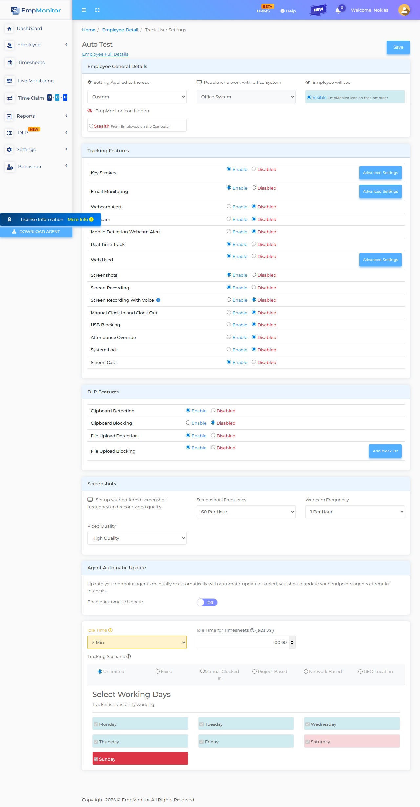

# Custom Agent Stealth & Security Regression Report

> **Generated On**: `2026-08-27 09:29:07`  
> **Target Environment**: `DEV` (`https://app.dev.empmonitor.com`)  
> **Agent Version Evaluated**: `3.5.0`

---

## 1. Executive Summary & Verdicts

| Audit Dimension | Evaluation Result | Status |
| :--- | :--- | :--- |
| **Final Report Verdict** | **`FAILED`** | ❌ FAIL |
| **Covert Cloaking Verdict** | **`BREACHED (Trace elements found in Registry)`** | 🚨 BREACHED |
| **Cross-Environment Leak Check** | `LEAK DETECTED` (CRITICAL LEAK: 1 Live reference(s) or missing endpoint(s) detected in Dev configuration) | 🚨 LEAK DETECTED |
| **Dashboard Visibility Setting** | `Stealth` (Expected: Stealth) | ✅ ALIGNED |
| **Target Dashboard User** | `auto test` | ✅ FOUND |
| **Host INI Visibility Flag** | `MISMATCH (Expected stealth=false, got visibility=true)` | ⚠️ AUDIT |
| **Screencast Stream Status** | `STANDBY` | ⚪ STANDBY |

### ⚠️ Discrepancy & Security Breach Warnings

- 🔴 **[FAILURE REASON]**: Control Panel Registry Cloaking Failed: 2 trace element(s) discovered in uninstallation registry keys.
- 🔴 **[FAILURE REASON]**: Network Routing Mismatch: CRITICAL LEAK: Live production endpoint detected in Dev agent configuration (service.empmonitor.com - Live production service endpoint)!
- 🔴 **[FAILURE REASON]**: Email Discrepancy Mismatch! Local Host Email ('autotest@gmail.com') != Dashboard Email ('autotest@empmonitor.com')

---

## 2. Custom Binary & Process Mapping

| Executable Role | Configured Process Name | Disk Binary Status | Host Process Runtime Status |
| :--- | :--- | :--- | :--- |
| **Main Agent** | `DisplayConfigManager.exe` | `NOT DETECTED ON DISK` | `RUNNING (PID=27424, Status=running)` |
| **Watchdog / Service** | `UpdateMgr_Emp.exe` | `NOT DETECTED ON DISK` | `INACTIVE` |
| **Screencast / Helper** | `esr.exe` | `NOT DETECTED ON DISK` | `INACTIVE` |
| **Helper Service** | `emp_psa_service.exe` | `NOT DETECTED ON DISK` | `INACTIVE` |

---

## 3. Windows Control Panel Visibility Audit (winreg)

To verify that the custom stealth agent is invisible to host users in the Windows Control Panel (Add/Remove Programs), the three primary Windows uninstallation registry hives were audited:

| Scanned Registry Pathway | Scope / Architecture | Subkeys Audited | Cloaking Status |
| :--- | :--- | :---: | :--- |
| `HKLM\SOFTWARE\Microsoft\Windows\CurrentVersion\Uninstall (64-bit)` | 64-bit System Applications (HKLM) | 53 | **BREACHED (2 traces found)** |
| `HKLM\SOFTWARE\Wow6432Node\Microsoft\Windows\CurrentVersion\Uninstall (32-bit)` | 32-bit Applications on 64-bit OS (HKLM Wow6432Node) | 46 | **SECURE (0 traces found)** |
| `HKCU\Software\Microsoft\Windows\CurrentVersion\Uninstall` | Current User Scope Applications (HKCU) | 11 | **SECURE (0 traces found)** |

### 🚨 Detected Registry Breach Entries

| Registry Hive | SubKey Name | Matched Field | Matched Value | Trigger Token |
| :--- | :--- | :--- | :--- | :--- |
| `64-bit System Applications (HKLM)` | `{B947E73A-E61B-463E-8F77-FECADB809F50}` | `DisplayName` | `DisplayConfigManager` | `displayconfigmanager` |
| `64-bit System Applications (HKLM)` | `{B947E73A-E61B-463E-8F77-FECADB809F50}` | `Publisher` | `DisplayConfigManager` | `displayconfigmanager` |

---

## 4. Host Configuration & Storage Diagnostics (L1 / L2)

- **Local INI Path**: `C:\Users\GBSBHL1261\AppData\Roaming\screen\OjUxFCN\empm.ini`
- **INI File Size**: `4.47 KB` (EV-001 Requirement: > 3.0 KB)
- **Local Active Host Email**: `autotest@gmail.com`
- **Visibility Flag in INI**: `true` (MISMATCH (Expected stealth=false, got visibility=true))

### Sanitized `config.js` Contents (Masked)
```json
Not Found
```

### Sanitized `empm.ini` Attributes (Masked)
```ini
[General] last_sync_time = @DateTime(\0\0\0\x10\0\0\0\0\0\0%\x8e`\x2\x6~/\0)
[appSettings] currentdate = @Variant(\0\0\0\xe\0%\x8e`)
[appSettings] datasendingperiodsec = 180
[appSettings] lastsettingsaccessdatetime = @DateTime(\0\0\0\x10\0\0\0\0\0\0%\x8e`\0\xda\xe5\xf9\x1)
[appSettings] todayremainingbreakinseconds = 1800
[appSettings] from_remote\aduserinfosendpersec = 21600
[appSettings] from_remote\screenshotperiodsec = 60
[appSettings] screenshotquality = 20
[auth] token = ****************
[auth] email = autotest@gmail.com
[auth] crypto_password = ****************
[settings] code = 200
[settings] data\agentuninstallcode = 
[settings] data\announcemnts = @Invalid()
[settings] data\block\contact = undefined
[settings] data\block\email = undefined
[settings] data\block\logo = https://service.empmonitor.com/logo/1662536930741remote_lock_logo.png
[settings] data\breakinminute = 0
[settings] data\dlpfeatures\bluetoothblock = 0
[settings] data\dlpfeatures\bluetoothdetection = 0
[settings] data\dlpfeatures\clipboardblock = 0
[settings] data\dlpfeatures\clipboarddetection = 1
[settings] data\email_monitoring_block_websites = @Variant(\0\0\0\t\0\0\0\x1\0\0\0\n\0\0\0\x1a\0g\0l\0o\0\x62\0u\0s\0s\0o\0\x66\0t\0.\0i\0n)
[settings] data\features\screencast = 1
[settings] data\features\application_usage = 0
[settings] data\features\autocheckout = 0
[settings] data\features\block_websites = 1
[settings] data\features\email_monitoring = 1
[settings] data\features\file_upload_blocking = 1
[settings] data\features\file_upload_detection = 1
[settings] data\features\keystrokes = *
[settings] data\features\mobile_detection_webcam_alert_enabled = 0
[settings] data\features\realtimetrack = 1
[settings] data\features\remoteterminalaccess = 0
[settings] data\features\screen_record = 0
[settings] data\features\screenshots = 1
[settings] data\features\webcamcapture = 0
[settings] data\features\webcamcasting = 0
[settings] data\features\web_usage = 1
[settings] data\features\webcam_alert_enabled = 0
[settings] data\file_upload_block_websites = gemini.google.com, whatsapp.com, chatgpt.com, web.telegram.org, www.ilovepdf.com
[settings] data\file_upload_screenshot_alert = 1
[settings] data\first_name = auto
[settings] data\idleinminute = 5
[settings] data\issilahmobilegeolocation = 0
[settings] data\is_attendance_override = 0
[settings] data\last_name = test
[settings] data\logo = https://service.empmonitor.com/logo/1662536930741remote_lock_logo.png
[settings] data\logoutoptions\afterfixedhours = 8
[settings] data\logoutoptions\option = 2
[settings] data\logoutoptions\specifictimeutc = 23:59
[settings] data\logoutoptions\specifictimeuser = 23:59
[settings] data\logout_feature = true
[settings] data\manual_clock_in = 0
[settings] data\pack\expiry = 2037-12-31
[settings] data\pack\id = 1
[settings] data\roomid = a8a877faab1ec5ac0f53520f41a544cb:ebbc73a4ba20cd12389171e3b5a291bc
[settings] data\screen_record\audio = 0
[settings] data\screen_record\is_enabled = 0
[settings] data\screen_record\video_quality = 1
[settings] data\screenshot\frequencyperhour = 60
[settings] data\silahmobilegeolocationfrequency = 30
[settings] data\system\autoupdate = 0
[settings] data\system\tracking = 1
[settings] data\system\type = 1
[settings] data\system\visibility = true
[settings] data\systemlock = 0
[settings] data\timesheetidletime = 00:00
[settings] data\tracking\app\appblocklist = @Invalid()
[settings] data\tracking\app\keystrokeblocklist = ****************
[settings] data\tracking\app\keystrokewhitelist = ****************
[settings] data\tracking\domain\appblocklist = 
[settings] data\tracking\domain\daysandtimes = @Variant(\0\0\0\b\0\0\0\0)
[settings] data\tracking\domain\keystrokeblocklist = **********
[settings] data\tracking\domain\keystrokewhitelist = **********
[settings] data\tracking\domain\monitoronly = @Invalid()
[settings] data\tracking\domain\suspendkeystrokespasswords = *****
[settings] data\tracking\domain\suspendkeystrokeswhenvisited = **********
[settings] data\tracking\domain\suspendmonitorwhencontains = @Invalid()
[settings] data\tracking\domain\suspendmonitorwhenvisited = @Invalid()
[settings] data\tracking\domain\suspendmonitorwhenvisitedincategory = @Invalid()
[settings] data\tracking\domain\suspendprivatebrowsing = false
[settings] data\tracking\domain\websiteblocklist = @Variant(\0\0\0\t\0\0\0\x1\0\0\0\n\0\0\0 \0w\0w\0w\0.\0\x66\0\x61\0\x63\0\x65\0\x62\0o\0o\0k\0.\0\x63\0o\0m)
[settings] data\tracking\geolocation = @Invalid()
[settings] data\tracking\keystrokepolicymode = *******
[settings] data\tracking\networkbased = @Invalid()
[settings] data\tracking\projectbased = @Invalid()
[settings] data\tracking\unlimited\day = "1,2,3,4,5,6,7"
[settings] data\trackingmode = unlimited
[settings] data\usbdisable = 0
[settings] data\userblock = 0
[settings] data\webcam\frequencyperhour = 1
[settings] error = @Variant(\0\0\0\x94)
[settings] message = User configs
```

---

## 5. Layer 3 (L3) - Telemetry & API Routing Audit

- **Target Environment Status:** `dev`
- **Authentication Route:** `https://track.dev.empmonitor.com/api/v3` (✅ VERIFIED)
- **Screenshots Upload Pipeline:** `https://activity.dev.emmonitor.com/api/v1` (✅ VERIFIED)
- **Active Screencast Host:** `remote-dev.empmonitor.com` (✅ VERIFIED)
- **Active Service Endpoint:** `service.dev.empmonitor.com` (✅ VERIFIED)
- **Auto-Updates Server:** `https://updates.empmonitor.in/dev/` (✅ VERIFIED)
- **Cross-Environment Leak Check:** `LEAK DETECTED` (CRITICAL LEAK: 1 Live reference(s) or missing endpoint(s) detected in Dev configuration)

---

## 6. Host Log Harvest (Last 200 Lines)

```text
2026-08-27T03:33:54Z - critical: > Driver error: ""

2026-08-27T03:33:54Z - critical: > Native error code: ""

2026-08-27T03:33:54Z - critical: > Error type 0

2026-08-27T03:34:14Z - info: Requesting for url : /auth/authenticate   Reply code : 0  server message : ""  error message : ""

2026-08-27T03:34:14Z - info: Changing tracking mode from " initial " to " "unlimited" "
2026-08-27T03:34:14Z - info: DB opened
2026-08-27T03:34:14Z - warning: QObject: Cannot create children for a parent that is in a different thread.
(Parent is activity_tracker::ui::qt::NetworkAccessManager(0x1ec8a7ffcc0), parent's thread is QThread(0xd721b0f880), current thread is QThread(0x1ec867c7ac0)
2026-08-27T03:34:14Z - critical: thisApp()->m_isLogoutEnabled in worker  true
2026-08-27T03:34:14Z - info: Setting the logout btn visility to true
2026-08-27T03:34:14Z - critical: QJsonArray(["www.facebook.com"])
2026-08-27T03:34:14Z - info: Exclude website list (data/tracking/domain/excludeWebsiteList): ()
2026-08-27T03:34:14Z - info: Requesting url :  "https://track.empmonitor.com/api/v3/user/config"  Reply code :  200  server message : "User configs"
2026-08-27T03:34:14Z - info: Requesting url :  "https://track.empmonitor.com/api/v3/user/me"  Reply code :  200  server message : "Logged in user"
2026-08-27T03:34:14Z - info: Requesting url :  "https://track.empmonitor.com/api/v3/user/system-info"  Reply code :  200  server message : "User system info is already the latest"
2026-08-27T03:34:17Z - info: > Installing AppAndBrowser monitor hook...

2026-08-27T03:34:17Z - info: Creating InputMonitorManager

2026-08-27T03:34:17Z - info: Creating InputMonitor

2026-08-27T03:34:17Z - info: Inside thread

2026-08-27T03:34:17Z - info: Entered InputMonitor run thread

2026-08-27T03:34:17Z - info: Dummy window created

2026-08-27T03:34:17Z - info: Keyboard layout changed: en-US

2026-08-27T03:34:17Z - info: Installing mouse hook...

2026-08-27T03:34:17Z - info: Installing keyboard hook...

2026-08-27T03:34:17Z - info: Changing InputMonitor state STARTING -> RUNNING

2026-08-27T03:34:48Z - info: Requesting url :  "https://track.empmonitor.com/api/v3/user/system-info"  Reply code :  200  server message : "User system info is already the latest"

2026-08-27T03:35:16Z - info: Requesting url :  "https://storelogs.dev.empmonitor.com/api/v1/desktop/upload-screenshots"  Reply code :  0  server message : "Successfully screenshot uploaded"

2026-08-27T03:35:48Z - info: Requesting url :  "https://track.empmonitor.com/api/v3/user/system-info"  Reply code :  200  server message : "User system info is already the latest"

2026-08-27T03:36:16Z - info: Requesting url :  "https://storelogs.dev.empmonitor.com/api/v1/desktop/upload-screenshots"  Reply code :  0  server message : "Successfully screenshot uploaded"

2026-08-27T03:36:48Z - info: Requesting url :  "https://track.empmonitor.com/api/v3/user/system-info"  Reply code :  200  server message : "User system info is already the latest"

2026-08-27T03:36:48Z - info: Position Updated

2026-08-27T03:36:48Z - info: Position Updated at : "Thu Aug 27 2026" , "09:06:48" , Latitude:  21.2013 ,  Longitude:  81.3239

2026-08-27T03:36:50Z - info: Requesting url :  "https://track.empmonitor.com/api/v3/user/config"  Reply code :  200  server message : "User configs"

2026-08-27T03:37:16Z - info: Adding new session data with id  QDateTime(2026-08-27 03:34:16.079 UTC Qt::UTC)

2026-08-27T03:37:16Z - info: Trying to send new session data

2026-08-27T03:37:16Z - info: Requesting for add-activity   Reply code : 200  server message : "Data saved"  error message : ""

2026-08-27T03:37:16Z - info: Memory Usage : 16.4883 MB

2026-08-27T03:37:16Z - info: Requesting url :  "https://storelogs.dev.empmonitor.com/api/v1/desktop/upload-screenshots"  Reply code :  0  server message : "Successfully screenshot uploaded"

2026-08-27T03:37:48Z - info: Requesting url :  "https://track.empmonitor.com/api/v3/user/system-info"  Reply code :  200  server message : "User system info is already the latest"

2026-08-27T03:38:16Z - info: Requesting url :  "https://storelogs.dev.empmonitor.com/api/v1/desktop/upload-screenshots"  Reply code :  0  server message : "Successfully screenshot uploaded"

2026-08-27T03:38:48Z - info: Requesting url :  "https://track.empmonitor.com/api/v3/user/system-info"  Reply code :  200  server message : "User system info is already the latest"

2026-08-27T03:39:16Z - info: Requesting url :  "https://storelogs.dev.empmonitor.com/api/v1/desktop/upload-screenshots"  Reply code :  0  server message : "Successfully screenshot uploaded"

2026-08-27T03:39:48Z - info: Requesting url :  "https://track.empmonitor.com/api/v3/user/system-info"  Reply code :  200  server message : "User system info is already the latest"

2026-08-27T03:39:48Z - info: Position Updated

2026-08-27T03:39:48Z - info: Position Updated at : "Thu Aug 27 2026" , "09:09:48" , Latitude:  21.2013 ,  Longitude:  81.3239

2026-08-27T03:39:48Z - info: Position Updated

2026-08-27T03:39:48Z - info: Position Updated at : "Thu Aug 27 2026" , "09:09:48" , Latitude:  21.2013 ,  Longitude:  81.3239

2026-08-27T03:39:50Z - info: Requesting url :  "https://track.empmonitor.com/api/v3/user/config"  Reply code :  200  server message : "User configs"

2026-08-27T03:40:16Z - info: Adding new session data with id  QDateTime(2026-08-27 03:37:16.080 UTC Qt::UTC)

2026-08-27T03:40:16Z - info: Trying to send new session data

2026-08-27T03:40:16Z - info: Requesting for add-activity   Reply code : 200  server message : "Data saved"  error message : ""

2026-08-27T03:40:16Z - info: Memory Usage : 17.3203 MB

2026-08-27T03:40:16Z - info: Requesting url :  "https://storelogs.dev.empmonitor.com/api/v1/desktop/upload-screenshots"  Reply code :  0  server message : "Successfully screenshot uploaded"

2026-08-27T03:40:48Z - info: Requesting url :  "https://track.empmonitor.com/api/v3/user/system-info"  Reply code :  200  server message : "User system info is already the latest"

2026-08-27T03:41:16Z - info: Requesting url :  "https://storelogs.dev.empmonitor.com/api/v1/desktop/upload-screenshots"  Reply code :  0  server message : "Successfully screenshot uploaded"

2026-08-27T03:41:48Z - info: Requesting url :  "https://track.empmonitor.com/api/v3/user/system-info"  Reply code :  200  server message : "User system info is already the latest"

2026-08-27T03:42:16Z - info: Requesting url :  "https://storelogs.dev.empmonitor.com/api/v1/desktop/upload-screenshots"  Reply code :  0  server message : "Successfully screenshot uploaded"

2026-08-27T03:42:48Z - info: Requesting url :  "https://track.empmonitor.com/api/v3/user/system-info"  Reply code :  200  server message : "User system info is already the latest"

2026-08-27T03:42:48Z - info: Position Updated

2026-08-27T03:42:48Z - info: Position Updated at : "Thu Aug 27 2026" , "09:12:48" , Latitude:  21.2013 ,  Longitude:  81.3239

2026-08-27T03:42:48Z - info: Position Updated

2026-08-27T03:42:48Z - info: Position Updated at : "Thu Aug 27 2026" , "09:12:48" , Latitude:  21.2013 ,  Longitude:  81.3239

2026-08-27T03:42:50Z - info: Requesting url :  "https://track.empmonitor.com/api/v3/user/config"  Reply code :  200  server message : "User configs"

2026-08-27T03:43:16Z - info: Adding new session data with id  QDateTime(2026-08-27 03:40:16.080 UTC Qt::UTC)

2026-08-27T03:43:16Z - info: Trying to send new session data

2026-08-27T03:43:16Z - info: Requesting for add-activity   Reply code : 200  server message : "Data saved"  error message : ""

2026-08-27T03:43:16Z - info: Memory Usage : 17.2891 MB

2026-08-27T03:43:16Z - info: Requesting url :  "https://storelogs.dev.empmonitor.com/api/v1/desktop/upload-screenshots"  Reply code :  0  server message : "Successfully screenshot uploaded"

2026-08-27T03:43:48Z - info: Requesting url :  "https://track.empmonitor.com/api/v3/user/system-info"  Reply code :  200  server message : "User system info is already the latest"

2026-08-27T03:44:16Z - info: Requesting url :  "https://storelogs.dev.empmonitor.com/api/v1/desktop/upload-screenshots"  Reply code :  0  server message : "Successfully screenshot uploaded"

2026-08-27T03:44:48Z - info: Requesting url :  "https://track.empmonitor.com/api/v3/user/system-info"  Reply code :  200  server message : "User system info is already the latest"

2026-08-27T03:45:16Z - info: Requesting url :  "https://storelogs.dev.empmonitor.com/api/v1/desktop/upload-screenshots"  Reply code :  0  server message : "Successfully screenshot uploaded"

2026-08-27T03:45:48Z - info: Position Updated

2026-08-27T03:45:48Z - info: Position Updated at : "Thu Aug 27 2026" , "09:15:48" , Latitude:  21.2013 ,  Longitude:  81.3239

2026-08-27T03:45:48Z - info: Position Updated

2026-08-27T03:45:48Z - info: Position Updated at : "Thu Aug 27 2026" , "09:15:48" , Latitude:  21.2013 ,  Longitude:  81.3239

2026-08-27T03:45:48Z - info: Requesting url :  "https://track.empmonitor.com/api/v3/user/system-info"  Reply code :  200  server message : "User system info is already the latest"

2026-08-27T03:45:50Z - info: Requesting url :  "https://track.empmonitor.com/api/v3/user/config"  Reply code :  200  server message : "User configs"

2026-08-27T03:46:16Z - info: Adding new session data with id  QDateTime(2026-08-27 03:43:16.152 UTC Qt::UTC)

2026-08-27T03:46:16Z - info: Trying to send new session data

2026-08-27T03:46:16Z - info: Requesting for add-activity   Reply code : 200  server message : "Data saved"  error message : ""

2026-08-27T03:46:16Z - info: Memory Usage : 17.2539 MB

2026-08-27T03:46:16Z - info: Requesting url :  "https://storelogs.dev.empmonitor.com/api/v1/desktop/upload-screenshots"  Reply code :  0  server message : "Successfully screenshot uploaded"

2026-08-27T03:46:48Z - info: Requesting url :  "https://track.empmonitor.com/api/v3/user/system-info"  Reply code :  200  server message : "User system info is already the latest"

2026-08-27T03:47:16Z - warning: Could not get the INetworkConnection instance for the adapter GUID.

2026-08-27T03:47:16Z - info: Requesting url :  "https://storelogs.dev.empmonitor.com/api/v1/desktop/upload-screenshots"  Reply code :  0  server message : "Successfully screenshot uploaded"


!!!!!!!!! Application started at Thu Aug 27 03:47:17 2026 GMT UTC time

2026-08-27T03:47:17Z - info: Changing tracking mode from " initial " to " "unlimited" "
2026-08-27T03:47:17Z - critical: thisApp()->m_isLogoutEnabled in settings  true
2026-08-27T03:47:17Z - info: QVariant(QString, "Allow")
2026-08-27T03:47:17Z - info: QVariant(QString, "Allow")
2026-08-27T03:47:17Z - info: Shared key "emp_monitor_shared_memory_for_user_GBSBHL1261"
2026-08-27T03:47:17Z - info: Setting shared key
2026-08-27T03:47:17Z - info: Assigning registry value
2026-08-27T03:47:17Z - info: Registering instances
2026-08-27T03:47:17Z - info: Worker thread instance
2026-08-27T03:47:17Z - info: Network thread instance
2026-08-27T03:47:17Z - critical: Trying to get watchdog service
2026-08-27T03:47:17Z - warning: QWidget::setLayout: Attempting to set QLayout "" on QStackedWidget "", which already has a layout
2026-08-27T03:47:17Z - info: VERSION:  3.0.1
2026-08-27T03:47:17Z - info: Setting the logout btn visility to true
2026-08-27T03:47:18Z - warning: QCssParser::parseHexColor: Unknown color name '#solid'
2026-08-27T03:47:18Z - warning: Could not parse application stylesheet
2026-08-27T03:47:17Z - info: Setting network thread
2026-08-27T03:47:17Z - info: Setting worker thread
2026-08-27T03:47:17Z - warning: serialnmea: No known GPS device found. Specify the COM port via QT_NMEA_SERIAL_PORT.
2026-08-27T03:47:17Z - info: DB opened
2026-08-27T03:47:17Z - info: Last application was not closed properly and last clock data staretd at  QDateTime(2026-08-27 03:34:16.076 UTC Qt::UTC)  is not closed properly.
2026-08-27T03:47:17Z - info: Find the time of prevous app shutdown.  QDateTime(2026-08-27 03:47:16.049 UTC Qt::UTC)
2026-08-27T03:47:17Z - info: recovering not closed clock data  QDateTime(2026-08-27 03:34:16.076 UTC Qt::UTC)  from previous app
2026-08-27T03:47:17Z - info: Position Updated
2026-08-27T03:47:17Z - info: Position Updated at : "Thu Aug 27 2026" , "09:17:17" , Latitude:  21.2013 ,  Longitude:  81.3239
2026-08-27T03:47:17Z - warning: Could not get the INetworkConnection instance for the adapter GUID.
2026-08-27T03:47:17Z - warning: Could not get the INetworkConnection instance for the adapter GUID.
2026-08-27T03:47:17Z - critical: thisApp()->m_isLogoutEnabled in worker  true
2026-08-27T03:47:17Z - critical: QJsonArray(["www.facebook.com"])
2026-08-27T03:47:17Z - info: Exclude website list (data/tracking/domain/excludeWebsiteList): ()
2026-08-27T03:47:17Z - info: timerForStorageDevice started
2026-08-27T03:47:17Z - info: Requesting url :  "https://track.empmonitor.com/api/v3/user/config"  Reply code :  200  server message : "User configs"
2026-08-27T03:47:17Z - info: Requesting url :  "https://track.empmonitor.com/api/v3/user/system-info"  Reply code :  200  server message : "User system info"
2026-08-27T03:47:18Z - warning: Could not get the INetworkConnection instance for the adapter GUID.
2026-08-27T03:47:18Z - critical: Skipping the non-removable device:  "C:/"
```

---

## 7. Layer 4 Visual Evidence Artifacts

### Evidence: `01_employee_grid_match.png`

Link: [01_employee_grid_match.png](evidence/01_employee_grid_match.png)

### Evidence: `02_user_tracking_settings.png`

Link: [02_user_tracking_settings.png](evidence/02_user_tracking_settings.png)
