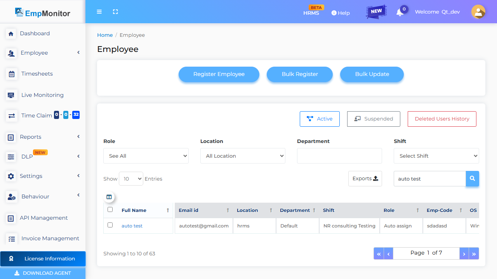
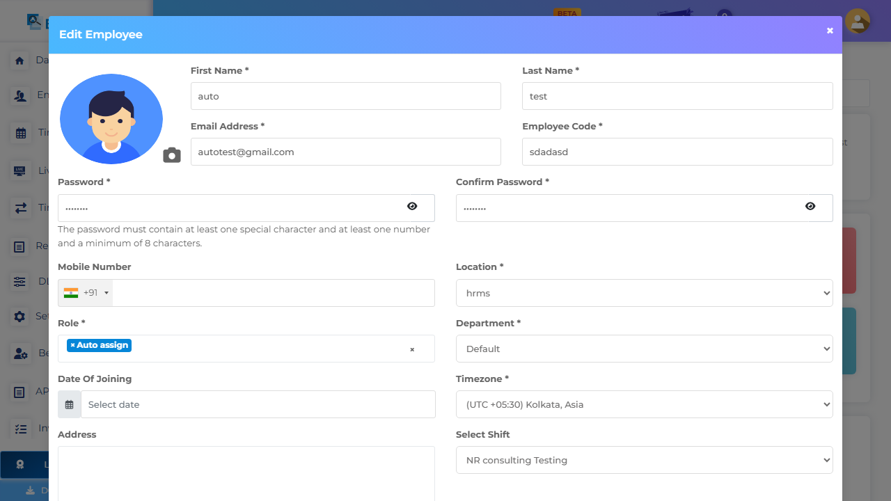
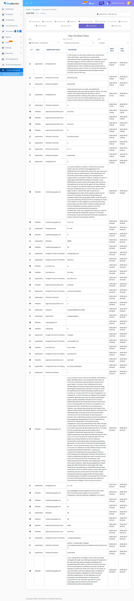
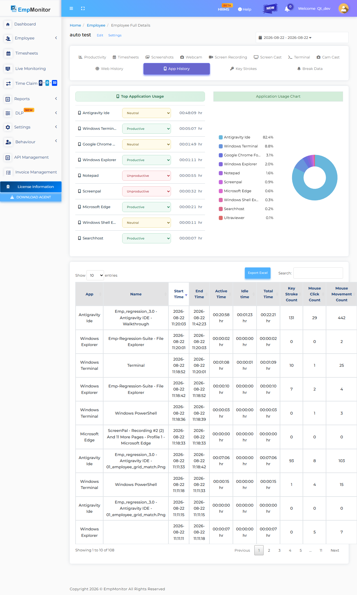
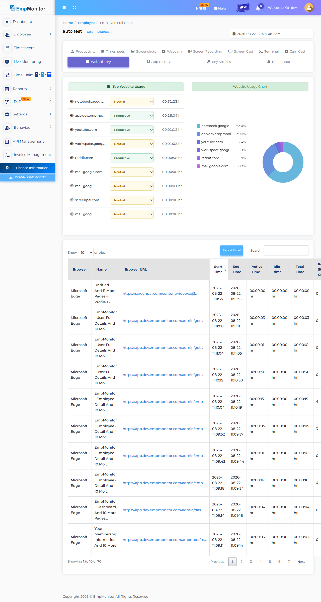
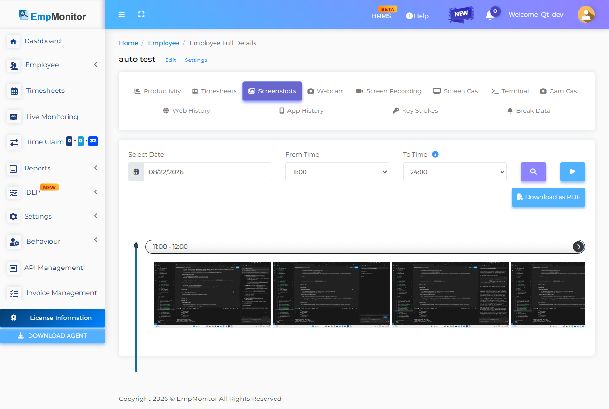
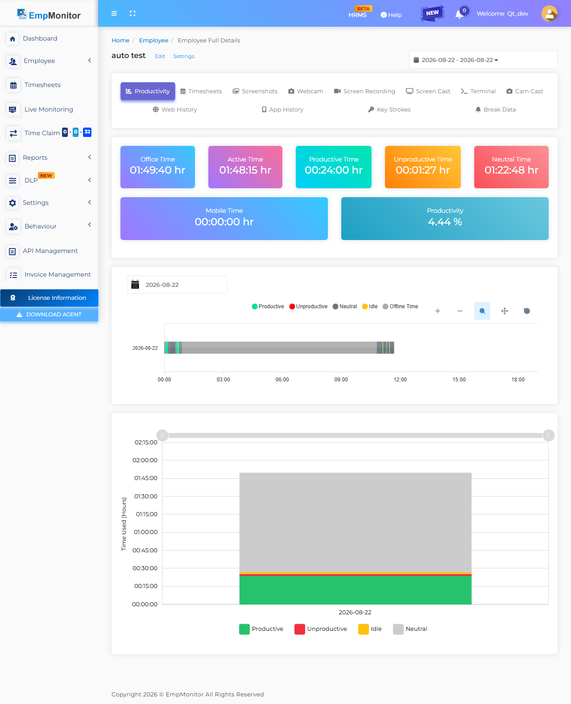
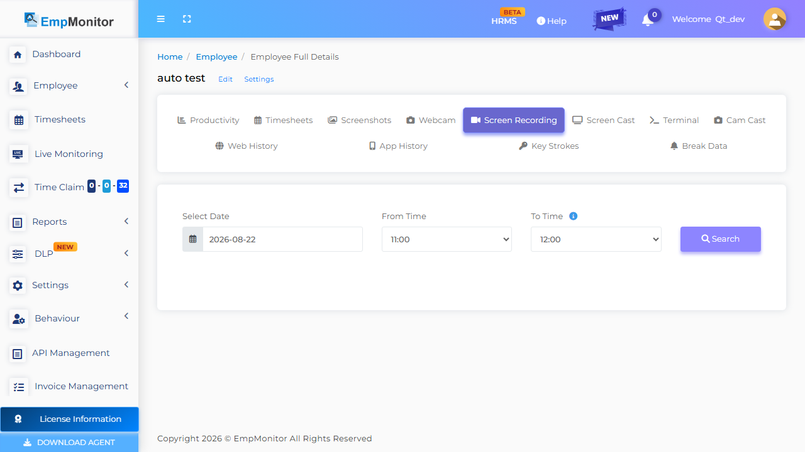

# EmpMonitor 3.0 Automated Regression Test Report

## 1. Execution Metadata Summary

- **Date & Time**: `2026-08-22 11:45:29`
- **Agent Version Evaluated**: `3.2.0`
- **Local Active Host Email (L1)**: `autotest@gmail.com`
- **Searched Dashboard User (L4)**: `auto test`
- **Dashboard Registered Email (L4)**: `autotest@gmail.com`
- **Final System Verdict**: **`HEALTHY`**

---

## 2. Layer 1 System Configuration Audit

- **Local INI Path**: `C:\Users\Ad tester\AppData\Roaming\screen\OjUpjH-\empm.ini`
- **INI File Size**: `7.13 KB` (EV-001 Requirement: > 3.0 KB)

### Binary Presence & Running Process Status

- **Binary `empmonitor.exe`**: FOUND
- **Binary `UpdateMgr_Emp.exe`**: FOUND
- **Binary `esr.exe`**: FOUND
- **Binary `emp_psa_service.exe`**: FOUND
- **Process `empmonitor.exe`**: RUNNING (running)
- **Process `updatemgr_emp.exe`**: RUNNING (running)
- **Process `esr.exe`**: INACTIVE
- **Process `emp_psa_service.exe`**: RUNNING (running)

### Sanitized `config.js` Contents (Masked)
```json
{
    "id": "OjUpRD5",
    "api": "https://activity.dev.empmonitor.com/api/v1/",
    "login": "https://track.dev.empmonitor.com/api/v3/",
    "pipeline": "https://track.dev.empmonitor.com/api/v3/",
    "realtime": "wss://remote-dev.empmonitor.com",
    "updates": "https://updates.empmonitor.in/dev/",
    "mode": "personal"
}
```

### Sanitized `empm.ini` Attributes (Masked)
```ini
last_sync_time = @DateTime(\0\0\0\x10\0\0\0\0\0\0%\x8e[\x2\x83\x13\xa8\0)
is_system_locked = false
currentdate = @Variant(\0\0\0\xe\0%\x8e[)
datasendingperiodsec = 180
lastsettingsaccessdatetime = @DateTime(\0\0\0\x10\0\0\0\0\0\0%\x8e[\x1V\xe7\xa5\x1)
todayremainingbreakinseconds = 1800
from_remote\aduserinfosendpersec = 21600
from_remote\screenshotperiodsec = 60
screenshotquality = 20
token = ****************
email = autotest@gmail.com
crypto_password = ****************
code = 200
data\activity_log_update_frequency = 20
data\agentuninstallcode = 
data\announcemnts = @Invalid()
data\block\contact = undefined
data\block\email = undefined
data\block\logo = https://service.dev.empmonitor.com/logo/1667192712953remote_lock_logo.png
data\breakinminute = 0
data\dlpfeatures\bluetoothblock = 0
data\dlpfeatures\bluetoothdetection = 1
data\dlpfeatures\clipboardblock = 0
data\dlpfeatures\clipboarddetection = 1
data\email_monitoring_block_websites = @Variant(\0\0\0\t\0\0\0\x1\0\0\0\n\0\0\0\x12\0g\0m\0\x61\0i\0l\0.\0\x63\0o\0m)
data\features\screencast = 1
data\features\app_block = 0
data\features\application_usage = 0
data\features\autocheckout = 0
data\features\block_websites = 0
data\features\blue_block = 0
data\features\blue_detec = 0
data\features\clip_block = 0
data\features\clip_detec = 1
data\features\email_monitoring = 1
data\features\file_upload_blocking = 0
data\features\file_upload_detection = 0
data\features\keystrokes = *
data\features\location = 0
data\features\print_block = 0
data\features\print_blocking = 0
data\features\print_detection = 0
data\features\realtimetrack = 0
data\features\recordvoicevideo = 1
data\features\remoteterminalaccess = 1
data\features\screen_record = 0
data\features\screenshots = 1
data\features\system_lock = 0
data\features\usb_block = 0
data\features\usb_detec = 0
data\features\webcamcapture = 0
data\features\webcamcasting = 0
data\features\web_block = 0
data\features\web_usage = 1
data\features\webcam_alert_enabled = 0
data\file_upload_screenshot_alert = 1
data\first_name = auto
data\idleinminute = 5
data\issilahmobilegeolocation = 0
data\is_attendance_override = 0
data\last_name = test
data\logo = https://service.dev.empmonitor.com/logo/1667192712953remote_lock_logo.png
data\logoutoptions\afterfixedhours = 8
data\logoutoptions\option = 2
data\logoutoptions\specifictimeutc = 23:59
data\logoutoptions\specifictimeuser = 23:59
data\logout_feature = true
data\manual_clock_in = 1
data\pack\expiry = 2037-12-31
data\pack\id = 1
data\roomid = 7e5c3cc252aca2ef3d6835d30d947953:2d28e58e181e6de7372e6280b59366b1
data\screen_record\audio = 1
data\screen_record\is_enabled = 1
data\screen_record\video_quality = 1
data\screenshot\frequencyperhour = 60
data\silahmobilegeolocationfrequency = 30
data\system\autoupdate = 1
data\system\tracking = 1
data\system\type = 1
data\system\visibility = true
data\systemlock = 0
data\system_log_update_frequency = 20
data\timesheetidletime = 00:00
data\tracking\app\appblocklist = @Invalid()
data\tracking\app\keystrokeblocklist = **********
data\tracking\app\keystrokewhitelist = ****************
data\tracking\domain\appblocklist = esr.exe
data\tracking\domain\daysandtimes = @Variant(\0\0\0\b\0\0\0\0)
data\tracking\domain\keystrokeblocklist = ****************
data\tracking\domain\keystrokewhitelist = **********
data\tracking\domain\monitoronly = @Invalid()
data\tracking\domain\suspendkeystrokespasswords = *****
data\tracking\domain\suspendkeystrokeswhenvisited = **********
data\tracking\domain\suspendmonitorwhencontains = @Invalid()
data\tracking\domain\suspendmonitorwhenvisited = @Invalid()
data\tracking\domain\suspendmonitorwhenvisitedincategory = @Invalid()
data\tracking\domain\suspendprivatebrowsing = false
data\tracking\domain\websiteblocklist = @Invalid()
data\tracking\geolocation = @Invalid()
data\tracking\keystrokepolicymode = *******
data\tracking\networkbased = @Invalid()
data\tracking\projectbased = @Invalid()
data\tracking\unlimited\day = "1,2,3,4,5,6,7"
data\trackingmode = unlimited
data\usbdisable = 0
data\userblock = 0
data\username = @Variant(\0\0\0\x94)
data\webcam\frequencyperhour = 1
data\work_hour_billing\billing_based_on = active_hours
data\work_hour_billing\hours_per_day = 0
data\work_hour_billing\invoice_duration = weekly
data\work_hour_billing\is_enabled = 0
error = @Variant(\0\0\0\x94)
message = User configs
data\features\mobile_detection_webcam_alert_enabled = 0
data\geolocationalert\enabled = 1
data\geolocationalert\locations = @Variant(\0\0\0\t\0\0\0\x1\0\0\0\b\0\0\0\x4\0\0\0\n\0r\0\x61\0n\0g\0\x65\0\0\0\x4\0\0\0\0\0\0\0\x64\0\0\0\x12\0l\0o\0n\0g\0i\0t\0u\0\x64\0\x65\0\0\0\x6@TT'RT`\xaa\0\0\0\x18\0l\0o\0\x63\0\x61\0t\0i\0o\0n\0N\0\x61\0m\0\x65\0\0\0\n\0\0\0\x6\0G\0l\0o\0\0\0\x10\0l\0\x61\0t\0i\0t\0u\0\x64\0\x65\0\0\0\x6@51\x89\x37K\xc6\xa8)
data\file_upload_block_application = @Variant(\0\0\0\t\0\0\0\x1\0\0\0\n\0\0\0\x10\0T\0\x65\0l\0\x65\0g\0r\0\x61\0m)
data\file_upload_block_websites = @Variant(\0\0\0\t\0\0\0\x1\0\0\0\n\0\0\0 \0w\0w\0w\0.\0i\0l\0o\0v\0\x65\0p\0\x64\0\x66\0.\0\x63\0o\0m)
data\screen_record_when_website_visit = "youtube.com,netflix.com,facebook.com"
data\screenshot_exclude_websites = @Variant(\0\0\0\t\0\0\0\x1\0\0\0\n\0\0\0 \0w\0\x65\0\x62\0.\0w\0h\0\x61\0t\0s\0\x61\0p\0p\0.\0\x63\0o\0m)
data\tracking\app\daysandtimes\fri\status = false
data\tracking\app\daysandtimes\fri\time\end = 19:00
data\tracking\app\daysandtimes\fri\time\start = 10:00
data\tracking\app\daysandtimes\mon\status = false
data\tracking\app\daysandtimes\mon\time\end = 19:00
data\tracking\app\daysandtimes\mon\time\start = 10:00
data\tracking\app\daysandtimes\sat\status = false
data\tracking\app\daysandtimes\sat\time\end = 19:00
data\tracking\app\daysandtimes\sat\time\start = 10:00
data\tracking\app\daysandtimes\sun\status = false
data\tracking\app\daysandtimes\sun\time\end = 19:00
data\tracking\app\daysandtimes\sun\time\start = 10:00
data\tracking\app\daysandtimes\thu\status = false
data\tracking\app\daysandtimes\thu\time\end = 19:00
data\tracking\app\daysandtimes\thu\time\start = 10:00
data\tracking\app\daysandtimes\tue\status = false
data\tracking\app\daysandtimes\tue\time\end = 19:00
data\tracking\app\daysandtimes\tue\time\start = 10:00
data\tracking\app\daysandtimes\wed\status = false
data\tracking\app\daysandtimes\wed\time\end = 19:00
data\tracking\app\daysandtimes\wed\time\start = 10:00
data\tracking\app\idletimethreshold = 10
data\tracking\app\monitoronly = facebook, google chrome
data\tracking\app\suspendkeystrokeswhenused = ***************
data\tracking\app\suspendwhenused = wallet, bankApp
data\work_hour_billing\currency = inr
```

---

## 3. Layer 2 Host Log Harvest (Last 200 Lines)

```text


!!!!!!!!! Application started at Fri Aug 21 05:57:21 2026 GMT UTC time

2026-08-21T05:57:21Z - info: QVariant(QString, "Allow")
2026-08-21T05:57:21Z - info: QVariant(QString, "Allow")
2026-08-21T05:57:21Z - info: Shared key "emp_monitor_shared_memory_for_user_Ad tester"
2026-08-21T05:57:21Z - info: Setting shared key
2026-08-21T05:57:21Z - info: Assigning registry value
2026-08-21T05:57:21Z - info: Registering instances
2026-08-21T05:57:21Z - info: Worker thread instance
2026-08-21T05:57:21Z - info: Network thread instance
2026-08-21T05:57:21Z - critical: Trying to get watchdog service
2026-08-21T05:57:24Z - warning: QWidget::setLayout: Attempting to set QLayout "" on QStackedWidget "", which already has a layout
2026-08-21T05:57:24Z - info: VERSION:  3.2.0
2026-08-21T05:57:24Z - warning: QObject: Cannot create children for a parent that is in a different thread.
(Parent is activity_tracker::ui::qt::NetworkAccessManager(0x237ee855130), parent's thread is QThread(0xf96b4ffc98), current thread is QThread(0x237eaca3d40)
2026-08-21T05:57:25Z - warning: QObject: Cannot create children for a parent that is in a different thread.
(Parent is activity_tracker::ui::qt::NetworkAccessManager(0x237ee855130), parent's thread is QThread(0xf96b4ffc98), current thread is QThread(0x237eaca3d40)
2026-08-21T05:57:26Z - warning: QCssParser::parseHexColor: Unknown color name '#solid'
2026-08-21T05:57:21Z - info: Setting worker thread
2026-08-21T05:57:21Z - info: Setting network thread
2026-08-21T05:57:21Z - warning: serialnmea: No serial ports found
2026-08-21T05:57:22Z - info: DB opened
2026-08-21T05:57:22Z - info: Deleting pending registries older than NUMBER_OF_DAYS_TO_KEEP_DATA days
2026-08-21T05:57:22Z - info: >> Deleted -1 records
2026-08-21T05:57:22Z - info: Last application was not closed properly and last clock data staretd at  QDateTime(2026-08-19 17:12:15.087 UTC Qt::UTC)  is not closed properly.
2026-08-21T05:57:22Z - info: Find the time of prevous app shutdown.  QDateTime(2026-08-19 17:52:13.379 UTC Qt::UTC)
2026-08-21T05:57:22Z - info: recovering not closed clock data  QDateTime(2026-08-19 17:12:15.087 UTC Qt::UTC)  from previous app
2026-08-21T05:57:26Z - warning: QObject: Cannot create children for a parent that is in a different thread.
(Parent is activity_tracker::ui::qt::NetworkAccessManager(0x237ee855130), parent's thread is QThread(0xf96b4ffc98), current thread is QThread(0x237eaca3d40)
2026-08-21T05:57:23Z - info: Requesting for url :  "https://track.dev.empmonitor.com/api/v3/app-info"  Reply code : 200  server message : "Application info"
2026-08-21T05:57:23Z - info: Requesting for url :  "https://track.dev.empmonitor.com/api/v3/user/system-info"  Reply code : 0  server message : "Invalid token"
2026-08-21T05:57:23Z - info: Requesting for url : /authenticate/authenticate   Reply code : 0  server message : ""  error message : ""
2026-08-21T05:57:23Z - critical:  calling the myslot(0) from Auth api
2026-08-21T05:57:23Z - critical:  myslot called 
2026-08-21T05:57:23Z - critical: flagToPrint == 0 so unblocking
2026-08-21T05:57:23Z - info: Requesting for url : /authenticate/authenticate   Reply code : 0  server message : ""  error message : ""
2026-08-21T05:57:23Z - critical:  calling the myslot(0) from Auth api
2026-08-21T05:57:23Z - critical:  myslot called 
2026-08-21T05:57:23Z - critical: flagToPrint == 0 so unblocking
2026-08-21T05:57:24Z - warning: Unable to download new version! , reply: "<html>\r\n<head><title>404 Not Found</title></head>\r\n<body>\r\n<center><h1>404 Not Found</h1></center>\r\n<hr><center>nginx/1.18.0 (Ubuntu)</center>\r\n</body>\r\n</html>\r\n" ,err: "Error transferring https://updates.empmonitor.in/dev/windows64/3.2.2/gui.zlib - server replied: Not Found"
2026-08-21T05:57:26Z - info: > Installing AppAndBrowser monitor hook...

2026-08-21T05:57:26Z - info: Creating InputMonitorManager

2026-08-21T05:57:26Z - info: Creating InputMonitor

2026-08-21T05:57:25Z - info: Position Updated

2026-08-21T05:57:25Z - info: Position Updated at : "Fri Aug 21 2026" , "11:27:25" , Latitude:  24.5384 ,  Longitude:  75.1315

2026-08-21T05:57:26Z - info: Setting RecorderThread thread

2026-08-21T05:57:26Z - info: Setting SendRecordingsThread thread

2026-08-21T05:57:26Z - info: Requesting for url :  "https://track.dev.empmonitor.com/api/v3/user/me"  Reply code : 200  server message : "Logged in user"

2026-08-21T05:57:26Z - info: Inside thread

2026-08-21T05:57:26Z - info: Entered InputMonitor run thread

2026-08-21T05:57:26Z - info: Dummy window created

2026-08-21T05:57:26Z - info: Keyboard layout changed: en-GB

2026-08-21T05:57:26Z - info: Installing mouse hook...

2026-08-21T05:57:26Z - info: Installing keyboard hook...

2026-08-21T05:57:26Z - info: Changing InputMonitor state STARTING -> RUNNING

2026-08-21T05:57:26Z - info: Requesting for url :  "https://track.dev.empmonitor.com/api/v3/user/me"  Reply code : 200  server message : "Logged in user"

2026-08-21T05:57:27Z - info: Requesting for url :  "https://track.dev.empmonitor.com/api/v3/user/me"  Reply code : 200  server message : "Logged in user"

2026-08-21T05:57:32Z - critical: calling mycheckslot from planExpiryTimer that is single shot  false


!!!!!!!!! Application started at Fri Aug 21 05:57:50 2026 GMT UTC time

2026-08-21T05:57:50Z - info: QVariant(QString, "Allow")
2026-08-21T05:57:50Z - info: QVariant(QString, "Allow")
2026-08-21T05:57:50Z - info: Shared key "emp_monitor_shared_memory_for_user_Ad tester"
2026-08-21T05:57:50Z - critical: Another instanse of application(pid: 6692 ) is running
```

---

## 4. Layer 4 Visual Evidence Artifacts

### Evidence: `01_employee_grid_match.png`

Link: [01_employee_grid_match.png](evidence/01_employee_grid_match.png)

### Evidence: `02_employee_edit_modal.png`

Link: [02_employee_edit_modal.png](evidence/02_employee_edit_modal.png)

### Evidence: `03_keystrokes_module.png`

Link: [03_keystrokes_module.png](evidence/03_keystrokes_module.png)

### Evidence: `04_app_history_module.png`

Link: [04_app_history_module.png](evidence/04_app_history_module.png)

### Evidence: `05_web_history_module.png`

Link: [05_web_history_module.png](evidence/05_web_history_module.png)

### Evidence: `06_screenshots_module.png`

Link: [06_screenshots_module.png](evidence/06_screenshots_module.png)

### Evidence: `07_productivity_module.png`

Link: [07_productivity_module.png](evidence/07_productivity_module.png)

### Evidence: `08_screen_recording_module.png`

Link: [08_screen_recording_module.png](evidence/08_screen_recording_module.png)
