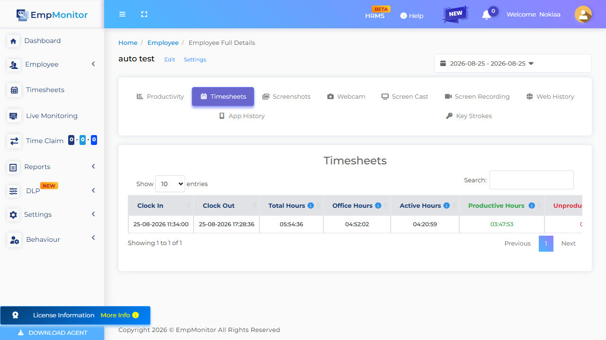
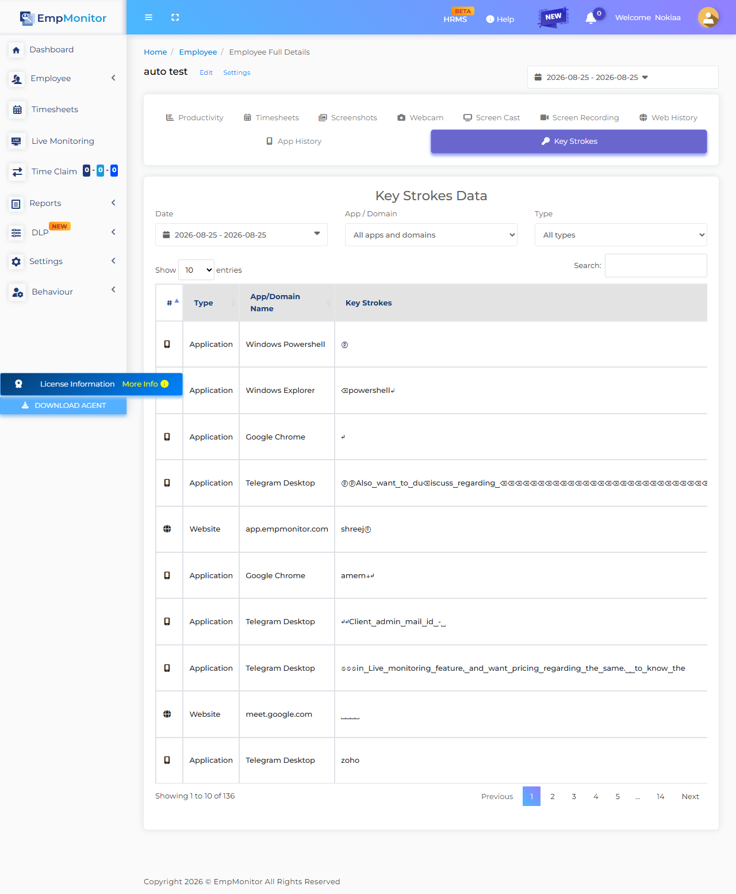
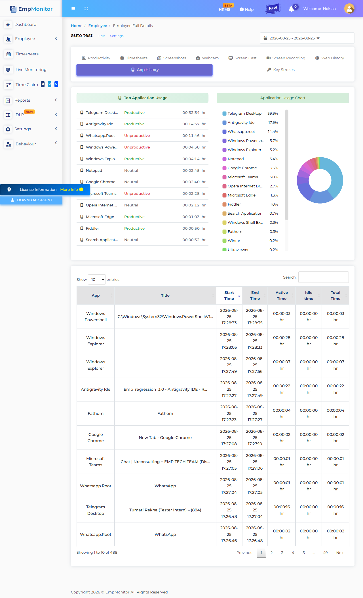
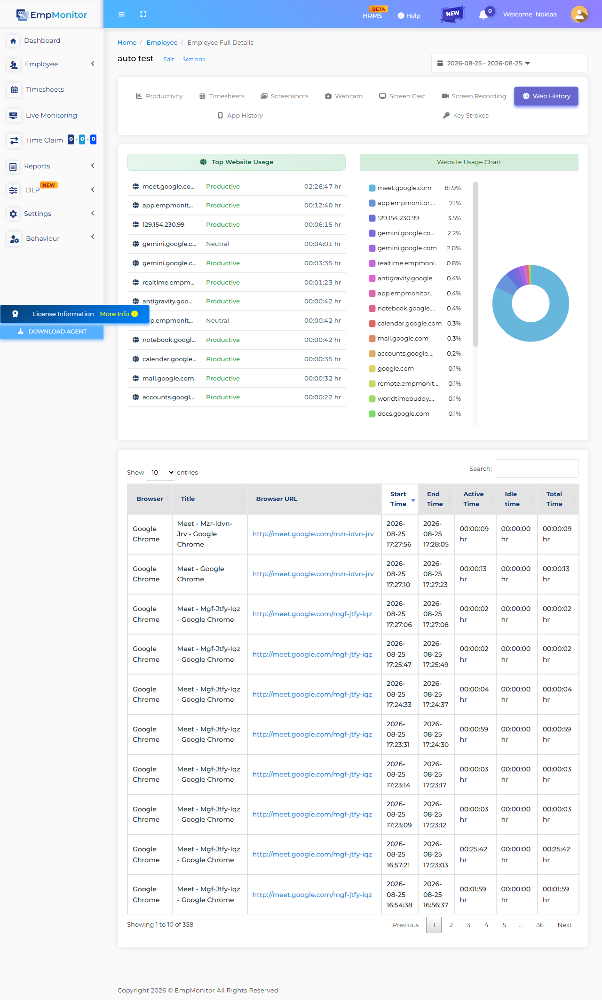
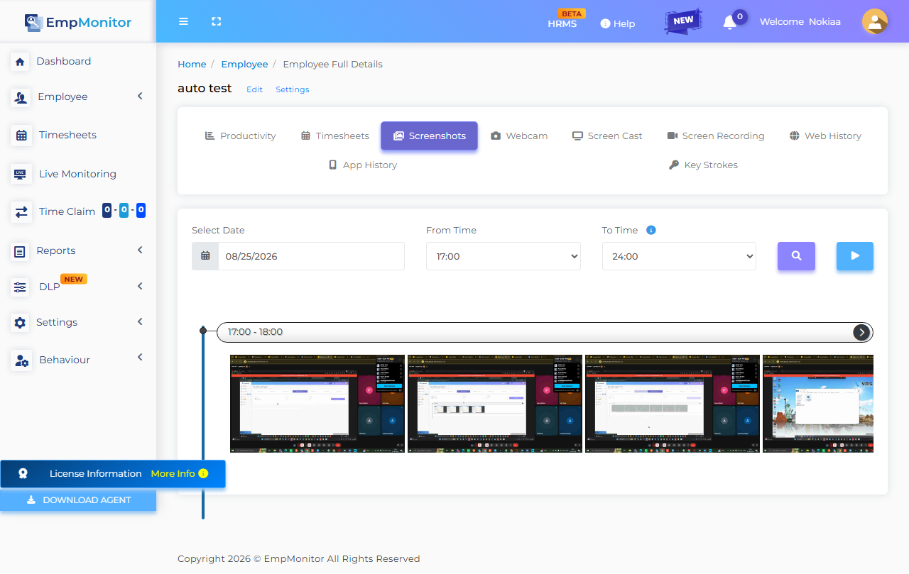
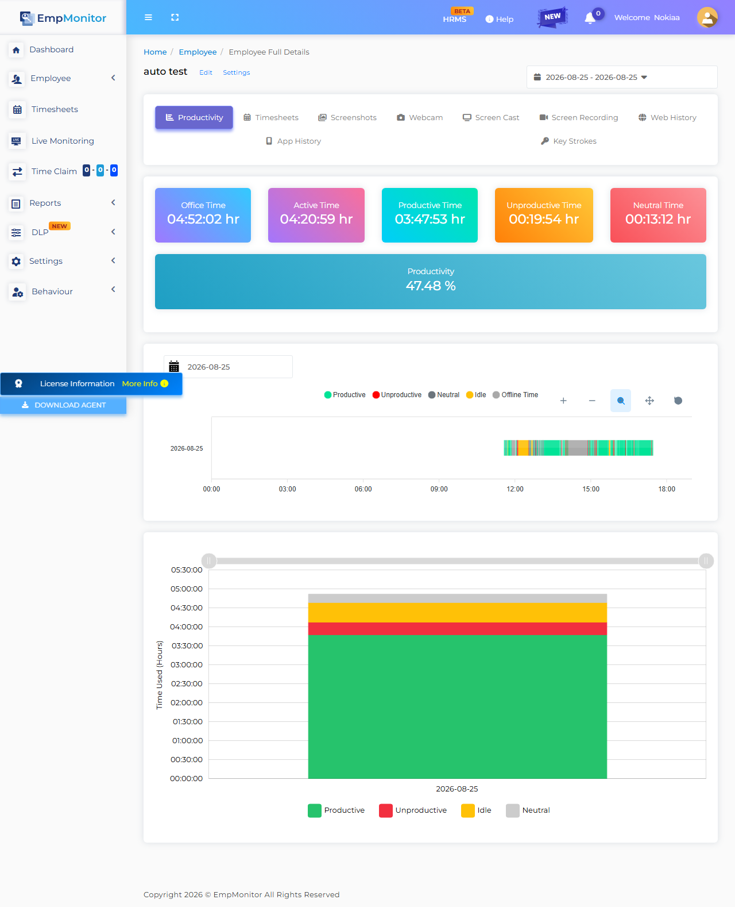

# EmpMonitor 3.0 Automated Regression Test Report

## 1. Execution Metadata Summary

- **Date & Time**: `2026-08-25 17:31:04`
- **Agent Version Evaluated**: `3.0.1`
- **Local Active Host Email (L1)**: `autotest@gmail.com`
- **Searched Dashboard User (L4)**: `auto test`
- **Dashboard Registered Email (L4)**: `autotest@gmail.com`
- **Final System Verdict**: **`HEALTHY`**

---

## 2. Layer 1 System Configuration Audit

- **Local INI Path**: `C:\Users\GBSBHL1261\AppData\Roaming\screen\OjUxFCN\empm.ini`
- **INI File Size**: `4.46 KB` (EV-001 Requirement: > 3.0 KB)

### Binary Presence & Running Process Status

- **Binary `empmonitor.exe`**: N/A (Legacy < 3.1.0)
- **Binary `UpdateMgr_Emp.exe`**: N/A (Legacy < 3.1.0)
- **Binary `esr.exe`**: N/A (Legacy < 3.1.0)
- **Binary `emp_psa_service.exe`**: N/A (Legacy < 3.1.0)
- **Process `empmonitor.exe`**: N/A (Legacy < 3.1.0)
- **Process `updatemgr_emp.exe`**: N/A (Legacy < 3.1.0)
- **Process `esr.exe`**: N/A (Legacy < 3.1.0)
- **Process `emp_psa_service.exe`**: N/A (Legacy < 3.1.0)

### Sanitized `config.js` Contents (Masked)
```json
{
    "id": "OjUpSmK",
    "api": "https://storelogs.dev.empmonitor.com/api/v1/",
    "login": "https://track.empmonitor.com/api/v3/",
    "pipeline": "https://track.empmonitor.com/api/v3/",
    "realtime": "wss://realtime.empmonitor.com",
    "updates": "https://updates.empmonitor.in/",
    "mode": "personal"
}
```

### Sanitized `empm.ini` Attributes (Masked)
```ini
last_sync_time = @DateTime(\0\0\0\x10\0\0\0\0\0\0%\x8e^\x3\xc0\nH\0)
is_system_locked = false
currentdate = @Variant(\0\0\0\xe\0%\x8e^)
datasendingperiodsec = 180
lastsettingsaccessdatetime = @DateTime(\0\0\0\x10\0\0\0\0\0\0%\x8e^\x2\x92\xf4\xb6\x1)
todayremainingbreakinseconds = 1800
from_remote\aduserinfosendpersec = 21600
from_remote\screenshotperiodsec = 60
screenshotquality = 20
token = ****************
email = autotest@gmail.com
crypto_password = ****************
code = 200
data\agentuninstallcode = 
data\announcemnts = @Invalid()
data\block\contact = undefined
data\block\email = undefined
data\block\logo = https://service.empmonitor.com/logo/1662536930741remote_lock_logo.png
data\breakinminute = 0
data\dlpfeatures\bluetoothblock = 0
data\dlpfeatures\bluetoothdetection = 0
data\dlpfeatures\clipboardblock = 0
data\dlpfeatures\clipboarddetection = 1
data\email_monitoring_block_websites = @Variant(\0\0\0\t\0\0\0\x1\0\0\0\n\0\0\0\x1a\0g\0l\0o\0\x62\0u\0s\0s\0o\0\x66\0t\0.\0i\0n)
data\features\screencast = 1
data\features\application_usage = 0
data\features\autocheckout = 0
data\features\block_websites = 1
data\features\email_monitoring = 1
data\features\file_upload_blocking = 1
data\features\file_upload_detection = 1
data\features\keystrokes = *
data\features\mobile_detection_webcam_alert_enabled = 0
data\features\realtimetrack = 1
data\features\remoteterminalaccess = 0
data\features\screen_record = 0
data\features\screenshots = 1
data\features\webcamcapture = 0
data\features\webcamcasting = 0
data\features\web_usage = 1
data\features\webcam_alert_enabled = 0
data\file_upload_block_websites = gemini.google.com, whatsapp.com, chatgpt.com, web.telegram.org, www.ilovepdf.com
data\file_upload_screenshot_alert = 1
data\first_name = auto
data\idleinminute = 5
data\issilahmobilegeolocation = 0
data\is_attendance_override = 0
data\last_name = test
data\logo = https://service.empmonitor.com/logo/1662536930741remote_lock_logo.png
data\logoutoptions\afterfixedhours = 8
data\logoutoptions\option = 2
data\logoutoptions\specifictimeutc = 23:59
data\logoutoptions\specifictimeuser = 23:59
data\logout_feature = true
data\manual_clock_in = 0
data\pack\expiry = 2037-12-31
data\pack\id = 1
data\roomid = a8a877faab1ec5ac0f53520f41a544cb:ebbc73a4ba20cd12389171e3b5a291bc
data\screen_record\audio = 0
data\screen_record\is_enabled = 0
data\screen_record\video_quality = 1
data\screenshot\frequencyperhour = 60
data\silahmobilegeolocationfrequency = 30
data\system\autoupdate = 0
data\system\tracking = 1
data\system\type = 1
data\system\visibility = true
data\systemlock = 0
data\timesheetidletime = 00:00
data\tracking\app\appblocklist = @Invalid()
data\tracking\app\keystrokeblocklist = ****************
data\tracking\app\keystrokewhitelist = ****************
data\tracking\domain\appblocklist = Telegram-desktop
data\tracking\domain\daysandtimes = @Variant(\0\0\0\b\0\0\0\0)
data\tracking\domain\keystrokeblocklist = **********
data\tracking\domain\keystrokewhitelist = **********
data\tracking\domain\monitoronly = @Invalid()
data\tracking\domain\suspendkeystrokespasswords = *****
data\tracking\domain\suspendkeystrokeswhenvisited = **********
data\tracking\domain\suspendmonitorwhencontains = @Invalid()
data\tracking\domain\suspendmonitorwhenvisited = @Invalid()
data\tracking\domain\suspendmonitorwhenvisitedincategory = @Invalid()
data\tracking\domain\suspendprivatebrowsing = false
data\tracking\domain\websiteblocklist = youtube.com, instagram.com, flipkart.com, cricbuzz.com
data\tracking\geolocation = @Invalid()
data\tracking\keystrokepolicymode = *******
data\tracking\networkbased = @Invalid()
data\tracking\projectbased = @Invalid()
data\tracking\unlimited\day = "1,2,3,4,5,6,7"
data\trackingmode = unlimited
data\usbdisable = 1
data\userblock = 0
data\webcam\frequencyperhour = 1
error = @Variant(\0\0\0\x94)
message = User configs
```

---

## 3. Layer 2 Host Log Harvest (Last 200 Lines)

```text
2026-08-25T11:23:37Z - info: Requesting url :  "https://storelogs.dev.empmonitor.com/api/v1/desktop/upload-screenshots"  Reply code :  0  server message : "Successfully screenshot uploaded"
2026-08-25T11:23:45Z - info: Requesting url :  "https://track.empmonitor.com/api/v3/user/system-info"  Reply code :  200  server message : "User system info is already the latest"
2026-08-25T11:23:46Z - info: Requesting url :  "https://track.empmonitor.com/api/v3/user/config"  Reply code :  200  server message : "User configs"
2026-08-25T11:24:37Z - info: Requesting url :  "https://storelogs.dev.empmonitor.com/api/v1/desktop/upload-screenshots"  Reply code :  0  server message : "Successfully screenshot uploaded"
2026-08-25T11:24:40Z - info: Position Updated
2026-08-25T11:24:40Z - info: Position Updated at : "Tue Aug 25 2026" , "16:54:40" , Latitude:  21.2013 ,  Longitude:  81.3239
2026-08-25T11:24:45Z - info: Requesting url :  "https://track.empmonitor.com/api/v3/user/system-info"  Reply code :  200  server message : "User system info is already the latest"
2026-08-25T11:24:50Z - info: Position Updated
2026-08-25T11:24:50Z - info: Position Updated at : "Tue Aug 25 2026" , "16:54:50" , Latitude:  21.2013 ,  Longitude:  81.3239
2026-08-25T11:25:36Z - info: Adding new session data with id  QDateTime(2026-08-25 11:22:36.954 UTC Qt::UTC)
2026-08-25T11:25:36Z - info: Trying to send new session data
2026-08-25T11:25:37Z - info: Requesting for add-activity   Reply code : 200  server message : "Data saved"  error message : ""
2026-08-25T11:25:37Z - info: Requesting url :  "https://storelogs.dev.empmonitor.com/api/v1/desktop/upload-screenshots"  Reply code :  0  server message : "Successfully screenshot uploaded"
2026-08-25T11:25:45Z - info: Requesting url :  "https://track.empmonitor.com/api/v3/user/system-info"  Reply code :  200  server message : "User system info is already the latest"
2026-08-25T11:26:37Z - info: Requesting url :  "https://storelogs.dev.empmonitor.com/api/v1/desktop/upload-screenshots"  Reply code :  0  server message : "Successfully screenshot uploaded"
2026-08-25T11:26:45Z - info: Requesting url :  "https://track.empmonitor.com/api/v3/user/system-info"  Reply code :  200  server message : "User system info is already the latest"
2026-08-25T11:26:46Z - info: Requesting url :  "https://track.empmonitor.com/api/v3/user/config"  Reply code :  200  server message : "User configs"
2026-08-25T11:27:00Z - info: Position Updated
2026-08-25T11:27:00Z - info: Position Updated at : "Tue Aug 25 2026" , "16:57:00" , Latitude:  21.2013 ,  Longitude:  81.3239
2026-08-25T11:27:37Z - info: Requesting url :  "https://storelogs.dev.empmonitor.com/api/v1/desktop/upload-screenshots"  Reply code :  0  server message : "Successfully screenshot uploaded"
2026-08-25T11:27:45Z - info: Requesting url :  "https://track.empmonitor.com/api/v3/user/system-info"  Reply code :  200  server message : "User system info is already the latest"
2026-08-25T11:27:50Z - info: Position Updated
2026-08-25T11:27:50Z - info: Position Updated at : "Tue Aug 25 2026" , "16:57:50" , Latitude:  21.2013 ,  Longitude:  81.3239
2026-08-25T11:28:36Z - info: Adding new session data with id  QDateTime(2026-08-25 11:25:36.963 UTC Qt::UTC)
2026-08-25T11:28:36Z - info: Trying to send new session data
2026-08-25T11:28:37Z - info: Requesting for add-activity   Reply code : 200  server message : "Data saved"  error message : ""
2026-08-25T11:28:37Z - info: Requesting url :  "https://storelogs.dev.empmonitor.com/api/v1/desktop/upload-screenshots"  Reply code :  0  server message : "Successfully screenshot uploaded"
2026-08-25T11:28:45Z - info: Requesting url :  "https://track.empmonitor.com/api/v3/user/system-info"  Reply code :  200  server message : "User system info is already the latest"
2026-08-25T11:29:37Z - info: Requesting url :  "https://storelogs.dev.empmonitor.com/api/v1/desktop/upload-screenshots"  Reply code :  0  server message : "Successfully screenshot uploaded"
2026-08-25T11:29:45Z - info: Requesting url :  "https://track.empmonitor.com/api/v3/user/system-info"  Reply code :  200  server message : "User system info is already the latest"
2026-08-25T11:29:46Z - info: Requesting url :  "https://track.empmonitor.com/api/v3/user/config"  Reply code :  200  server message : "User configs"
2026-08-25T11:30:00Z - info: Position Updated
2026-08-25T11:30:00Z - info: Position Updated at : "Tue Aug 25 2026" , "17:00:00" , Latitude:  21.2013 ,  Longitude:  81.3239
2026-08-25T11:30:37Z - info: Requesting url :  "https://storelogs.dev.empmonitor.com/api/v1/desktop/upload-screenshots"  Reply code :  0  server message : "Successfully screenshot uploaded"
2026-08-25T11:30:45Z - info: Requesting url :  "https://track.empmonitor.com/api/v3/user/system-info"  Reply code :  200  server message : "User system info is already the latest"
2026-08-25T11:30:50Z - info: Position Updated
2026-08-25T11:30:50Z - info: Position Updated at : "Tue Aug 25 2026" , "17:00:50" , Latitude:  21.2013 ,  Longitude:  81.3239
2026-08-25T11:31:36Z - info: Adding new session data with id  QDateTime(2026-08-25 11:28:36.960 UTC Qt::UTC)
2026-08-25T11:31:36Z - info: Trying to send new session data
2026-08-25T11:31:37Z - info: Requesting for add-activity   Reply code : 200  server message : "Data saved"  error message : ""
2026-08-25T11:31:37Z - info: Requesting url :  "https://storelogs.dev.empmonitor.com/api/v1/desktop/upload-screenshots"  Reply code :  0  server message : "Successfully screenshot uploaded"
2026-08-25T11:31:45Z - info: Requesting url :  "https://track.empmonitor.com/api/v3/user/system-info"  Reply code :  200  server message : "User system info is already the latest"
2026-08-25T11:32:37Z - info: Requesting url :  "https://storelogs.dev.empmonitor.com/api/v1/desktop/upload-screenshots"  Reply code :  0  server message : "Successfully screenshot uploaded"
2026-08-25T11:32:45Z - info: Requesting url :  "https://track.empmonitor.com/api/v3/user/system-info"  Reply code :  200  server message : "User system info is already the latest"
2026-08-25T11:32:46Z - info: Requesting url :  "https://track.empmonitor.com/api/v3/user/config"  Reply code :  200  server message : "User configs"
2026-08-25T11:33:00Z - info: Position Updated
2026-08-25T11:33:00Z - info: Position Updated at : "Tue Aug 25 2026" , "17:03:00" , Latitude:  21.2013 ,  Longitude:  81.3239
2026-08-25T11:33:37Z - info: Requesting url :  "https://storelogs.dev.empmonitor.com/api/v1/desktop/upload-screenshots"  Reply code :  0  server message : "Successfully screenshot uploaded"
2026-08-25T11:33:45Z - info: Requesting url :  "https://track.empmonitor.com/api/v3/user/system-info"  Reply code :  200  server message : "User system info is already the latest"
2026-08-25T11:34:00Z - info: Position Updated
2026-08-25T11:34:00Z - info: Position Updated at : "Tue Aug 25 2026" , "17:04:00" , Latitude:  21.2013 ,  Longitude:  81.3239
2026-08-25T11:34:36Z - info: Adding new session data with id  QDateTime(2026-08-25 11:31:36.954 UTC Qt::UTC)
2026-08-25T11:34:36Z - info: Trying to send new session data
2026-08-25T11:34:37Z - info: Requesting for add-activity   Reply code : 200  server message : "Data saved"  error message : ""
2026-08-25T11:34:37Z - info: Requesting url :  "https://storelogs.dev.empmonitor.com/api/v1/desktop/upload-screenshots"  Reply code :  0  server message : "Successfully screenshot uploaded"
2026-08-25T11:34:45Z - info: Requesting url :  "https://track.empmonitor.com/api/v3/user/system-info"  Reply code :  200  server message : "User system info is already the latest"
2026-08-25T11:35:37Z - info: Requesting url :  "https://storelogs.dev.empmonitor.com/api/v1/desktop/upload-screenshots"  Reply code :  0  server message : "Successfully screenshot uploaded"
2026-08-25T11:35:45Z - info: Requesting url :  "https://track.empmonitor.com/api/v3/user/system-info"  Reply code :  200  server message : "User system info is already the latest"
2026-08-25T11:35:46Z - info: Requesting url :  "https://track.empmonitor.com/api/v3/user/config"  Reply code :  200  server message : "User configs"
2026-08-25T11:36:10Z - info: Position Updated
2026-08-25T11:36:10Z - info: Position Updated at : "Tue Aug 25 2026" , "17:06:10" , Latitude:  21.2013 ,  Longitude:  81.3239
2026-08-25T11:36:37Z - info: Requesting url :  "https://storelogs.dev.empmonitor.com/api/v1/desktop/upload-screenshots"  Reply code :  0  server message : "Successfully screenshot uploaded"
2026-08-25T11:36:45Z - info: Requesting url :  "https://track.empmonitor.com/api/v3/user/system-info"  Reply code :  200  server message : "User system info is already the latest"
2026-08-25T11:37:00Z - info: Position Updated
2026-08-25T11:37:00Z - info: Position Updated at : "Tue Aug 25 2026" , "17:07:00" , Latitude:  21.2013 ,  Longitude:  81.3239
2026-08-25T11:37:22Z - critical: error for websocket :  QAbstractSocket::RemoteHostClosedError
2026-08-25T11:37:22Z - critical: error for websocket :  QAbstractSocket::RemoteHostClosedError
2026-08-25T11:37:22Z - critical: WebSocket state changed: QAbstractSocket::ClosingState
2026-08-25T11:37:22Z - critical: retry timer for websocket is stopped
2026-08-25T11:37:22Z - critical: WebSocket state changed: QAbstractSocket::UnconnectedState
2026-08-25T11:37:22Z - critical: retry timer for websocket is started
2026-08-25T11:37:27Z - critical: Test url realtime  "wss://realtime.empmonitor.com"
2026-08-25T11:37:27Z - critical: WebSocket state changed: QAbstractSocket::ConnectingState
2026-08-25T11:37:27Z - critical: retry timer for websocket is stopped
2026-08-25T11:37:27Z - critical: WebSocket state changed: QAbstractSocket::ConnectedState
2026-08-25T11:37:27Z - critical: retry timer for websocket is stopped
2026-08-25T11:37:27Z - critical: connected to server
2026-08-25T11:37:27Z - critical: Message Received from server :  "Agent authenticated successfully"
2026-08-25T11:37:28Z - critical: Message Received from server :  "User connected to the dashboard, start sending the activity"
2026-08-25T11:37:36Z - info: Adding new session data with id  QDateTime(2026-08-25 11:34:36.969 UTC Qt::UTC)
2026-08-25T11:37:36Z - info: Trying to send new session data
2026-08-25T11:37:37Z - info: Requesting for add-activity   Reply code : 200  server message : "Data saved"  error message : ""
2026-08-25T11:37:37Z - info: Requesting url :  "https://storelogs.dev.empmonitor.com/api/v1/desktop/upload-screenshots"  Reply code :  0  server message : "Successfully screenshot uploaded"
2026-08-25T11:37:45Z - info: Requesting url :  "https://track.empmonitor.com/api/v3/user/system-info"  Reply code :  200  server message : "User system info is already the latest"
2026-08-25T11:38:37Z - info: Requesting url :  "https://storelogs.dev.empmonitor.com/api/v1/desktop/upload-screenshots"  Reply code :  0  server message : "Successfully screenshot uploaded"
2026-08-25T11:38:45Z - info: Requesting url :  "https://track.empmonitor.com/api/v3/user/system-info"  Reply code :  200  server message : "User system info is already the latest"
2026-08-25T11:38:46Z - info: Requesting url :  "https://track.empmonitor.com/api/v3/user/config"  Reply code :  200  server message : "User configs"
2026-08-25T11:39:37Z - info: Requesting url :  "https://storelogs.dev.empmonitor.com/api/v1/desktop/upload-screenshots"  Reply code :  0  server message : "Successfully screenshot uploaded"
2026-08-25T11:39:45Z - info: Requesting url :  "https://track.empmonitor.com/api/v3/user/system-info"  Reply code :  200  server message : "User system info is already the latest"
2026-08-25T11:40:00Z - info: Position Updated
2026-08-25T11:40:00Z - info: Position Updated at : "Tue Aug 25 2026" , "17:10:00" , Latitude:  21.2013 ,  Longitude:  81.3239
2026-08-25T11:40:28Z - info: Position Updated
2026-08-25T11:40:28Z - info: Position Updated at : "Tue Aug 25 2026" , "17:10:28" , Latitude:  21.2013 ,  Longitude:  81.3239
2026-08-25T11:40:36Z - info: Adding new session data with id  QDateTime(2026-08-25 11:37:36.952 UTC Qt::UTC)
2026-08-25T11:40:36Z - info: Trying to send new session data
2026-08-25T11:40:37Z - info: Requesting for add-activity   Reply code : 200  server message : "Data saved"  error message : ""
2026-08-25T11:40:37Z - info: Requesting url :  "https://storelogs.dev.empmonitor.com/api/v1/desktop/upload-screenshots"  Reply code :  0  server message : "Successfully screenshot uploaded"
2026-08-25T11:40:45Z - info: Requesting url :  "https://track.empmonitor.com/api/v3/user/system-info"  Reply code :  200  server message : "User system info is already the latest"
2026-08-25T11:41:37Z - info: Requesting url :  "https://storelogs.dev.empmonitor.com/api/v1/desktop/upload-screenshots"  Reply code :  0  server message : "Successfully screenshot uploaded"
2026-08-25T11:41:45Z - info: Requesting url :  "https://track.empmonitor.com/api/v3/user/system-info"  Reply code :  200  server message : "User system info is already the latest"
2026-08-25T11:41:46Z - info: Requesting url :  "https://track.empmonitor.com/api/v3/user/config"  Reply code :  200  server message : "User configs"
2026-08-25T11:42:37Z - info: Requesting url :  "https://storelogs.dev.empmonitor.com/api/v1/desktop/upload-screenshots"  Reply code :  0  server message : "Successfully screenshot uploaded"
2026-08-25T11:42:45Z - info: Requesting url :  "https://track.empmonitor.com/api/v3/user/system-info"  Reply code :  200  server message : "User system info is already the latest"
2026-08-25T11:43:28Z - info: Position Updated
2026-08-25T11:43:28Z - info: Position Updated at : "Tue Aug 25 2026" , "17:13:28" , Latitude:  21.2013 ,  Longitude:  81.3239
2026-08-25T11:43:28Z - info: Position Updated
2026-08-25T11:43:28Z - info: Position Updated at : "Tue Aug 25 2026" , "17:13:28" , Latitude:  21.2013 ,  Longitude:  81.3239
2026-08-25T11:43:36Z - info: Adding new session data with id  QDateTime(2026-08-25 11:40:36.889 UTC Qt::UTC)
2026-08-25T11:43:36Z - info: Trying to send new session data
2026-08-25T11:43:37Z - info: Requesting for add-activity   Reply code : 200  server message : "Data saved"  error message : ""
2026-08-25T11:43:37Z - info: Requesting url :  "https://storelogs.dev.empmonitor.com/api/v1/desktop/upload-screenshots"  Reply code :  0  server message : "Successfully screenshot uploaded"
2026-08-25T11:43:45Z - info: Requesting url :  "https://track.empmonitor.com/api/v3/user/system-info"  Reply code :  200  server message : "User system info is already the latest"
2026-08-25T11:44:37Z - info: Requesting url :  "https://storelogs.dev.empmonitor.com/api/v1/desktop/upload-screenshots"  Reply code :  0  server message : "Successfully screenshot uploaded"
2026-08-25T11:44:45Z - info: Requesting url :  "https://track.empmonitor.com/api/v3/user/system-info"  Reply code :  200  server message : "User system info is already the latest"
2026-08-25T11:44:46Z - info: Requesting url :  "https://track.empmonitor.com/api/v3/user/config"  Reply code :  200  server message : "User configs"
2026-08-25T11:45:37Z - info: Requesting url :  "https://storelogs.dev.empmonitor.com/api/v1/desktop/upload-screenshots"  Reply code :  0  server message : "Successfully screenshot uploaded"
2026-08-25T11:45:45Z - info: Requesting url :  "https://track.empmonitor.com/api/v3/user/system-info"  Reply code :  200  server message : "User system info is already the latest"
2026-08-25T11:46:28Z - info: Position Updated
2026-08-25T11:46:28Z - info: Position Updated at : "Tue Aug 25 2026" , "17:16:28" , Latitude:  21.2013 ,  Longitude:  81.3239
2026-08-25T11:46:36Z - info: Adding new session data with id  QDateTime(2026-08-25 11:43:36.889 UTC Qt::UTC)
2026-08-25T11:46:36Z - info: Trying to send new session data
2026-08-25T11:46:37Z - info: Requesting for add-activity   Reply code : 200  server message : "Data saved"  error message : ""
2026-08-25T11:46:37Z - info: Requesting url :  "https://storelogs.dev.empmonitor.com/api/v1/desktop/upload-screenshots"  Reply code :  0  server message : "Successfully screenshot uploaded"
2026-08-25T11:46:45Z - info: Requesting url :  "https://track.empmonitor.com/api/v3/user/system-info"  Reply code :  200  server message : "User system info is already the latest"
2026-08-25T11:47:27Z - critical: error for websocket :  QAbstractSocket::RemoteHostClosedError
2026-08-25T11:47:27Z - critical: error for websocket :  QAbstractSocket::RemoteHostClosedError
2026-08-25T11:47:27Z - critical: WebSocket state changed: QAbstractSocket::ClosingState
2026-08-25T11:47:27Z - critical: retry timer for websocket is stopped
2026-08-25T11:47:27Z - critical: WebSocket state changed: QAbstractSocket::UnconnectedState
2026-08-25T11:47:27Z - critical: retry timer for websocket is started
2026-08-25T11:47:32Z - critical: Test url realtime  "wss://realtime.empmonitor.com"
2026-08-25T11:47:32Z - critical: WebSocket state changed: QAbstractSocket::ConnectingState
2026-08-25T11:47:32Z - critical: retry timer for websocket is stopped
2026-08-25T11:47:33Z - critical: WebSocket state changed: QAbstractSocket::ConnectedState
2026-08-25T11:47:33Z - critical: retry timer for websocket is stopped
2026-08-25T11:47:33Z - critical: connected to server
2026-08-25T11:47:33Z - critical: Message Received from server :  "Agent authenticated successfully"
2026-08-25T11:47:33Z - critical: Message Received from server :  "User connected to the dashboard, start sending the activity"
2026-08-25T11:47:37Z - info: Requesting url :  "https://storelogs.dev.empmonitor.com/api/v1/desktop/upload-screenshots"  Reply code :  0  server message : "Successfully screenshot uploaded"
2026-08-25T11:47:40Z - info: Position Updated
2026-08-25T11:47:40Z - info: Position Updated at : "Tue Aug 25 2026" , "17:17:40" , Latitude:  21.2013 ,  Longitude:  81.3239
2026-08-25T11:47:45Z - info: Requesting url :  "https://track.empmonitor.com/api/v3/user/system-info"  Reply code :  200  server message : "User system info is already the latest"
2026-08-25T11:47:46Z - info: Requesting url :  "https://track.empmonitor.com/api/v3/user/config"  Reply code :  200  server message : "User configs"
2026-08-25T11:48:37Z - info: Requesting url :  "https://storelogs.dev.empmonitor.com/api/v1/desktop/upload-screenshots"  Reply code :  0  server message : "Successfully screenshot uploaded"
2026-08-25T11:48:45Z - info: Requesting url :  "https://track.empmonitor.com/api/v3/user/system-info"  Reply code :  200  server message : "User system info is already the latest"
2026-08-25T11:49:36Z - info: Adding new session data with id  QDateTime(2026-08-25 11:46:36.889 UTC Qt::UTC)
2026-08-25T11:49:36Z - info: Trying to send new session data
2026-08-25T11:49:37Z - info: Requesting for add-activity   Reply code : 200  server message : "Data saved"  error message : ""
2026-08-25T11:49:37Z - info: Requesting url :  "https://storelogs.dev.empmonitor.com/api/v1/desktop/upload-screenshots"  Reply code :  0  server message : "Successfully screenshot uploaded"
2026-08-25T11:49:45Z - info: Requesting url :  "https://track.empmonitor.com/api/v3/user/system-info"  Reply code :  200  server message : "User system info is already the latest"
2026-08-25T11:49:53Z - info: Position Updated
2026-08-25T11:49:53Z - info: Position Updated at : "Tue Aug 25 2026" , "17:19:53" , Latitude:  21.2013 ,  Longitude:  81.3239
2026-08-25T11:50:33Z - info: Position Updated
2026-08-25T11:50:33Z - info: Position Updated at : "Tue Aug 25 2026" , "17:20:33" , Latitude:  21.2013 ,  Longitude:  81.3239
2026-08-25T11:50:37Z - info: Requesting url :  "https://storelogs.dev.empmonitor.com/api/v1/desktop/upload-screenshots"  Reply code :  0  server message : "Successfully screenshot uploaded"
2026-08-25T11:50:45Z - info: Requesting url :  "https://track.empmonitor.com/api/v3/user/system-info"  Reply code :  200  server message : "User system info is already the latest"
2026-08-25T11:50:46Z - info: Requesting url :  "https://track.empmonitor.com/api/v3/user/config"  Reply code :  200  server message : "User configs"
2026-08-25T11:51:37Z - info: Requesting url :  "https://storelogs.dev.empmonitor.com/api/v1/desktop/upload-screenshots"  Reply code :  0  server message : "Successfully screenshot uploaded"
2026-08-25T11:51:45Z - info: Requesting url :  "https://track.empmonitor.com/api/v3/user/system-info"  Reply code :  200  server message : "User system info is already the latest"
2026-08-25T11:52:36Z - info: Adding new session data with id  QDateTime(2026-08-25 11:49:36.889 UTC Qt::UTC)
2026-08-25T11:52:36Z - info: Trying to send new session data
2026-08-25T11:52:37Z - info: Requesting for add-activity   Reply code : 200  server message : "Data saved"  error message : ""
2026-08-25T11:52:37Z - info: Requesting url :  "https://storelogs.dev.empmonitor.com/api/v1/desktop/upload-screenshots"  Reply code :  0  server message : "Successfully screenshot uploaded"
2026-08-25T11:52:43Z - info: Position Updated
2026-08-25T11:52:43Z - info: Position Updated at : "Tue Aug 25 2026" , "17:22:43" , Latitude:  21.2013 ,  Longitude:  81.3239
2026-08-25T11:52:45Z - info: Requesting url :  "https://track.empmonitor.com/api/v3/user/system-info"  Reply code :  200  server message : "User system info is already the latest"
2026-08-25T11:53:37Z - info: Requesting url :  "https://storelogs.dev.empmonitor.com/api/v1/desktop/upload-screenshots"  Reply code :  0  server message : "Successfully screenshot uploaded"
2026-08-25T11:53:38Z - info: Position Updated
2026-08-25T11:53:38Z - info: Position Updated at : "Tue Aug 25 2026" , "17:23:38" , Latitude:  21.2013 ,  Longitude:  81.3239
2026-08-25T11:53:45Z - info: Requesting url :  "https://track.empmonitor.com/api/v3/user/system-info"  Reply code :  200  server message : "User system info is already the latest"
2026-08-25T11:53:46Z - info: Requesting url :  "https://track.empmonitor.com/api/v3/user/config"  Reply code :  200  server message : "User configs"
2026-08-25T11:54:37Z - info: Requesting url :  "https://storelogs.dev.empmonitor.com/api/v1/desktop/upload-screenshots"  Reply code :  0  server message : "Successfully screenshot uploaded"
2026-08-25T11:54:45Z - info: Requesting url :  "https://track.empmonitor.com/api/v3/user/system-info"  Reply code :  0  server message : "Exceeded the number of allotted requests in a specific time frame"
2026-08-25T11:54:45Z - critical: failed for URL:  QUrl("https://track.empmonitor.com/api/v3/user/system-info") netErrCode: QNetworkReply::AuthenticationRequiredError ,response: "{\"success\":false,\"error\":\"Exceeded the number of allotted requests in a specific time frame\",\"message\":\"Exceeded the number of allotted requests in a specific time frame\"}" ,netErrStr: "Host requires authentication"
2026-08-25T11:55:36Z - info: Adding new session data with id  QDateTime(2026-08-25 11:52:36.889 UTC Qt::UTC)
2026-08-25T11:55:36Z - info: Trying to send new session data
2026-08-25T11:55:37Z - info: Requesting for add-activity   Reply code : 200  server message : "Data saved"  error message : ""
2026-08-25T11:55:37Z - info: Requesting url :  "https://storelogs.dev.empmonitor.com/api/v1/desktop/upload-screenshots"  Reply code :  0  server message : "Successfully screenshot uploaded"
2026-08-25T11:55:45Z - info: Requesting url :  "https://track.empmonitor.com/api/v3/user/system-info"  Reply code :  0  server message : "Exceeded the number of allotted requests in a specific time frame"
2026-08-25T11:55:45Z - critical: failed for URL:  QUrl("https://track.empmonitor.com/api/v3/user/system-info") netErrCode: QNetworkReply::AuthenticationRequiredError ,response: "{\"success\":false,\"error\":\"Exceeded the number of allotted requests in a specific time frame\",\"message\":\"Exceeded the number of allotted requests in a specific time frame\"}" ,netErrStr: "Host requires authentication"
2026-08-25T11:55:52Z - info: Position Updated
2026-08-25T11:55:52Z - info: Position Updated at : "Tue Aug 25 2026" , "17:25:52" , Latitude:  21.2013 ,  Longitude:  81.3239
2026-08-25T11:56:37Z - info: Requesting url :  "https://storelogs.dev.empmonitor.com/api/v1/desktop/upload-screenshots"  Reply code :  0  server message : "Successfully screenshot uploaded"
2026-08-25T11:56:42Z - info: Position Updated
2026-08-25T11:56:42Z - info: Position Updated at : "Tue Aug 25 2026" , "17:26:42" , Latitude:  21.2013 ,  Longitude:  81.3239
2026-08-25T11:56:45Z - info: Requesting url :  "https://track.empmonitor.com/api/v3/user/system-info"  Reply code :  0  server message : "Exceeded the number of allotted requests in a specific time frame"
2026-08-25T11:56:45Z - critical: failed for URL:  QUrl("https://track.empmonitor.com/api/v3/user/system-info") netErrCode: QNetworkReply::AuthenticationRequiredError ,response: "{\"success\":false,\"error\":\"Exceeded the number of allotted requests in a specific time frame\",\"message\":\"Exceeded the number of allotted requests in a specific time frame\"}" ,netErrStr: "Host requires authentication"
2026-08-25T11:57:37Z - info: Requesting url :  "https://storelogs.dev.empmonitor.com/api/v1/desktop/upload-screenshots"  Reply code :  0  server message : "Successfully screenshot uploaded"
2026-08-25T11:57:45Z - info: Requesting url :  "https://track.empmonitor.com/api/v3/user/system-info"  Reply code :  200  server message : "User system info is already the latest"
2026-08-25T11:58:34Z - info: Keyboard layout changed: en-IN
2026-08-25T11:58:34Z - info: Keyboard layout changed: en-US
2026-08-25T11:58:36Z - info: Adding new session data with id  QDateTime(2026-08-25 11:55:36.890 UTC Qt::UTC)
2026-08-25T11:58:36Z - info: Trying to send new session data
2026-08-25T11:58:37Z - info: Requesting for add-activity   Reply code : 200  server message : "Data saved"  error message : ""
2026-08-25T11:58:37Z - info: Requesting url :  "https://storelogs.dev.empmonitor.com/api/v1/desktop/upload-screenshots"  Reply code :  0  server message : "Successfully screenshot uploaded"
2026-08-25T11:58:45Z - info: Requesting url :  "https://track.empmonitor.com/api/v3/user/system-info"  Reply code :  200  server message : "User system info is already the latest"
2026-08-25T11:58:53Z - info: Position Updated
2026-08-25T11:58:53Z - info: Position Updated at : "Tue Aug 25 2026" , "17:28:53" , Latitude:  21.2013 ,  Longitude:  81.3239
2026-08-25T11:59:37Z - info: Requesting url :  "https://storelogs.dev.empmonitor.com/api/v1/desktop/upload-screenshots"  Reply code :  0  server message : "Successfully screenshot uploaded"
2026-08-25T11:59:45Z - info: Requesting url :  "https://track.empmonitor.com/api/v3/user/system-info"  Reply code :  200  server message : "User system info is already the latest"
```

---

## 4. Layer 4 Visual Evidence Artifacts

### Evidence: `01_employee_grid_match.png`

Link: [01_employee_grid_match.png](evidence/01_employee_grid_match.png)

### Evidence: `02_employee_edit_modal.png`

Link: [02_employee_edit_modal.png](evidence/02_employee_edit_modal.png)

### Evidence: `03_timesheets_module.png`

Link: [03_timesheets_module.png](evidence/03_timesheets_module.png)

### Evidence: `04_keystrokes_module.png`

Link: [04_keystrokes_module.png](evidence/04_keystrokes_module.png)

### Evidence: `05_app_history_module.png`

Link: [05_app_history_module.png](evidence/05_app_history_module.png)

### Evidence: `06_web_history_module.png`

Link: [06_web_history_module.png](evidence/06_web_history_module.png)

### Evidence: `07_screenshots_module.png`

Link: [07_screenshots_module.png](evidence/07_screenshots_module.png)

### Evidence: `08_productivity_module.png`

Link: [08_productivity_module.png](evidence/08_productivity_module.png)
